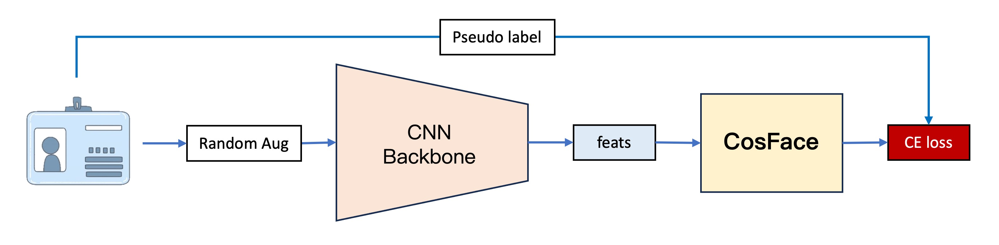
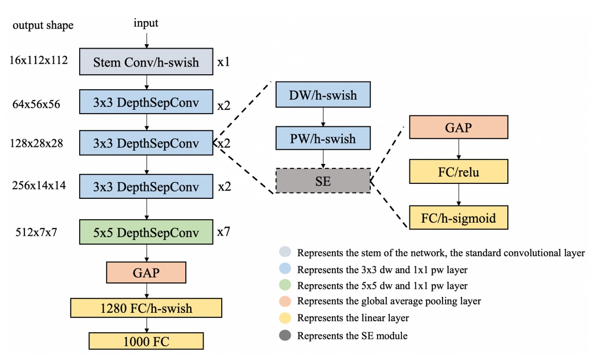
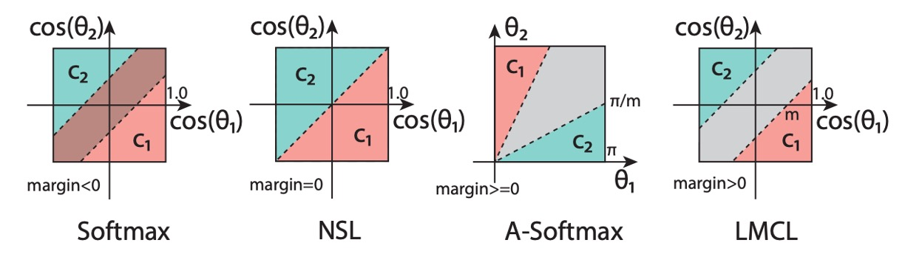
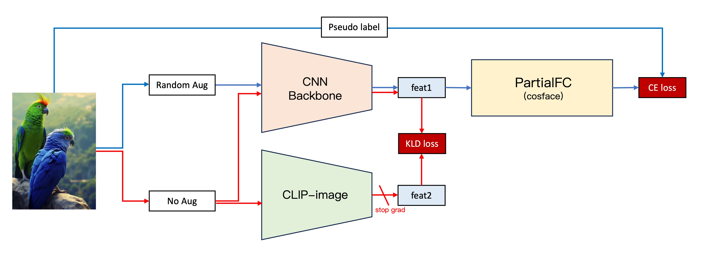

**[English](./README.md)** | [中文](./README_tw.md)

# DocClassifier

<p align="left">
    <a href="./LICENSE"></a>
    <a href="https://github.com/DocsaidLab/DocClassifier/releases"></a>
    <a href=""></a>
</p>

## Introduction

<div align="center">
    
</div>

DocClassifier is a document image classification system based on Metric Learning technology, inspired by the challenges faced by traditional classifiers in handling the rapid increase in document types and their definitional ambiguities. It adopts the PartialFC feature learning architecture and integrates techniques such as CosFace and ArcFace, allowing the model to perform accurate classification without a large number of predefined categories. By expanding the dataset and incorporating ImageNet-1K and CLIP models, we enhanced performance and increased the model's adaptability and scalability. The model is trained using PyTorch, infers on ONNXRuntime, and supports conversion to the ONNX format for deployment across different platforms. Our testing showed the model achieved over 90% accuracy, with fast inference speed and the ability to quickly add new document types, meeting the needs of most application scenarios.

## Documentation

Given the extensive usage instructions and settings explanations for this project, we only summarize the "Model Design" section here.

For more details, please refer to the [**DocClassifier Documents**](https://docsaid.org/en/docs/docclassifier/).

## Model Design

Creating a comprehensive model involves multiple adjustments and design iterations.

### First Generation Model



The first-generation model, our earliest version, has a basic architecture divided into four parts:

1. **Feature Extraction**

   

   This part converts images into vectors using [**PP-LCNet**](https://arxiv.org/abs/2109.15099) as the feature extractor.

   The input image is a 128 x 128 RGB image, which outputs a 256-dimensional vector after feature extraction.

2. **CosFace**

   [](https://arxiv.org/pdf/1801.09414.pdf)

   To test the effectiveness of metric learning, we directly used [**CosFace**](https://arxiv.org/abs/1801.09414), skipping traditional classifiers. CosFace introduces a margin parameter to the softmax loss function, enhancing the model's ability to distinguish different classes during training.

3. **Dataset**

   To train the model, we created a simple web crawler to collect document images.

   Approximately 650 different documents, mostly credit cards from major banks, were gathered.

   This dataset is available here: [**UniquePool**](https://github.com/DocsaidLab/DocClassifier/tree/main/data/unique_pool).

4. **Training**

   We used PyTorch for model training, considering each image as a separate class to ensure the model could identify subtle differences between documents. However, this approach required data augmentation due to the limited number of original images (only one per class).

   We used [**Albumentations**](https://github.com/albumentations-team/albumentations) for data augmentation to increase the dataset size.

---

The first-generation model validated our concept but revealed issues in practical applications:

1. **Stability**

   The model was unstable, sensitive to environmental changes, and document distortions during alignment significantly impacted performance.

2. **Performance**

   The model struggled with similar documents, indicating poor feature learning and difficulty distinguishing between different documents.

Our conclusion: **The model was overfitting!**

### Second Generation Model


The second-generation model introduced several improvements:

1. **More Data**

   We expanded the dataset by including [**Indoor Scene Recognition**](https://web.mit.edu/torralba/www/indoor.html) from MIT, adding 15,620 images of 67 different indoor scenes.

2. **Using PartialFC**

   

   As class numbers increased, we encountered the issue of large classification heads. [**PartialFC**](https://arxiv.org/abs/2203.15565) was introduced, demonstrating that sampling only 10% of classes during Softmax-based loss function training retained accuracy.

3. **More Data Augmentation**

   To combat overfitting, we augmented the dataset by defining each image's transformations (rotations, flips, and crops) as separate classes, expanding the dataset to (15,620 + 650) x 24 = 390,480 images (classes).

4. **Switching to ImageNet-1K**

   We replaced **Indoor Scene Recognition** with [**ImageNet-1K**](https://www.image-net.org/), providing 1,281,167 images across 1,000 classes. This solved the overfitting issue by significantly increasing data diversity.

### Third Generation Model



To achieve more stable models, we integrated new techniques:

1. **CLIP**

   Inspired by OpenAI's [**CLIP**](https://arxiv.org/abs/2103.00020), we aligned our model's features with CLIP's more robust feature vectors.

   The process:

   1. Maintain the second-generation architecture.
   2. Extract image features using our CNN backbone and CLIP-Image branch.
   3. Compute the KLD loss between the two feature vectors.
   4. Integrate the KLD loss into the original loss function, freezing CLIP-Image branch parameters.

   This approach significantly improved stability and validation dataset performance by nearly 5%.

2. **Stacking Normalization Layers**

   Experimenting with different normalization layers, we found a combination of BatchNorm and LayerNorm yielded the best results, enhancing performance by around 5%.

   ```python
   self.embed_feats = nn.Sequential(
       nn.Linear(in_dim_flatten, embed_dim, bias=False),
       nn.LayerNorm(embed_dim),
       nn.BatchNorm1d(embed_dim),
       nn.Linear(embed_dim, embed_dim, bias=False),
       nn.LayerNorm(embed_dim),
       nn.BatchNorm1d(embed_dim),
   )
   ```

## Conclusion

The third-generation model achieved significant improvements in stability and performance, showing satisfactory results in practical applications.

We consider the project's phase objectives met and hope our findings will benefit others.

## Citation

We appreciate the work of those before us, which greatly contributed to our research.

If you find our work helpful, please cite our repository:

```bibtex
@misc{lin2024docclassifier,
  author = {Kun-Hsiang Lin, Ze Yuan},
  title = {DocClassifier},
  year = {2024},
  publisher = {GitHub},
  url = {https://github.com/DocsaidLab/DocClassifier},
  note = {GitHub repository}
}
```
