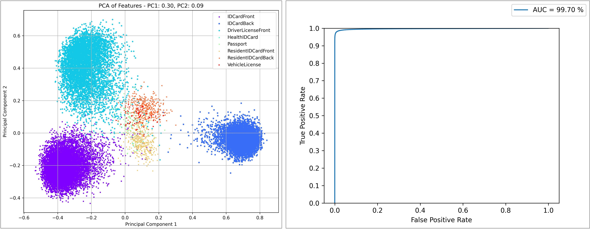
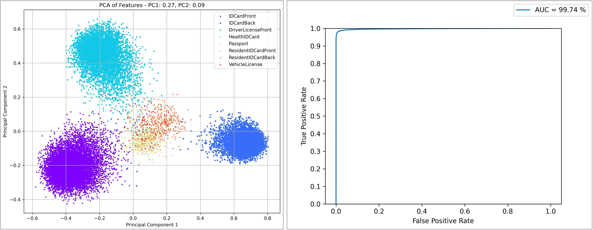
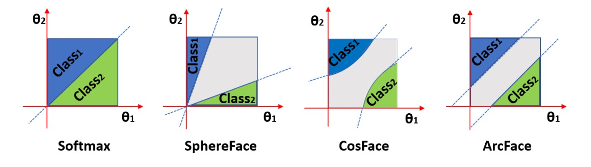

[English](./README.md) | **[中文](./README_cn.md)**

# DocClassifier

<p align="left">
    <a href="./LICENSE"></a>
    <a href="https://github.com/DocsaidLab/DocClassifier/releases"></a>
    <a href=""></a>
</p>

## Introduction

<div align="center">
    
</div>

DocClassifier is an innovative document image classification system, inspired by facial recognition technology and deeply optimized to address the limitations traditional classifiers face when dealing with text images. This system is particularly suited for scenarios that require rapid identification and registration of new text types, such as in fintech, banking, and the sharing economy sectors.

Our system employs advanced feature learning model architectures, combined with innovative loss functions like CosFace and ArcFace, effectively achieving precise classification without the need for presetting a large number of category heads. To train this model, we independently collected about 800 diverse text images and expanded our dataset through image enhancement techniques, ensuring the model learns a rich set of features.

Technically, we have chosen PyTorch as our primary training framework and utilized ONNXRuntime for model inference, ensuring efficient operation of the model on both CPU and GPU. Additionally, we support converting the model into ONNX format for flexible deployment across various platforms. For scenarios requiring model quantization, we offer static quantization functionality based on the ONNXRuntime API, further enhancing the model's application flexibility and performance.

On our validation dataset, our model demonstrated over 99% accuracy based on a zero-shot training strategy. Most importantly, when new document types need to be added, DocClassifier can quickly register them without the need for retraining, similar to the face registration process in facial recognition systems, significantly enhancing the system's adaptability and scalability. Furthermore, our model not only achieves real-time inference speeds in practical applications but also surpasses industry standards, meeting the needs of most application scenarios.

---

## Model Evaluation (Benchmark)

We have an internal test dataset, but due to privacy protection, we cannot make this dataset open source. We can only provide evaluation results based on this dataset.

### Evaluation Protocol

1. **AUROC**

    AUROC (Area Under the Receiver Operating Characteristic Curve) is a statistical metric used to evaluate the performance of classification models, especially in binary classification problems. The range of AUROC values is from 0 to 1, where a higher AUROC value indicates better ability of the model to distinguish between two classes.

    - **ROC Curve**

        1. **Definition**: The ROC curve is a graphical tool for evaluating the performance of classification models at all possible classification thresholds. It achieves this by plotting the True Positive Rate (TPR) against the False Positive Rate (FPR) at various thresholds.

        2. **True Positive Rate (TPR)**: Also known as sensitivity, calculated as TPR = TP / (TP + FN), where TP is the number of true positives, and FN is the number of false negatives.

        3. **False Positive Rate (FPR)**: Calculated as FPR = FP / (FP + TN), where FP is the number of false positives, and TN is the number of true negatives.

    - **AUROC Calculation**

        1. AUROC is the area under the ROC curve. It provides a single metric to summarize the model's performance across all possible classification thresholds.

        2. **Analysis**:
            - **AUROC = 1**: Perfect classifier, able to completely distinguish between the two classes.
            - **0.5 < AUROC < 1**: The model has the ability to differentiate between two classes, and the closer the AUROC value is to 1, the better the performance of the model.
            - **AUROC = 0.5**: No discriminative ability, equivalent to random guessing.
            - **AUROC < 0.5**: Worse than random guessing, but if the model's predictions are interpreted inversely (predicting positive class as negative and vice versa), it may perform better.

2. **Zero-shot Testing**

    We adopt a zero-shot testing strategy, ensuring that all categories or patterns in the test data do not appear in the training data. This means that during the training phase of the model, it has never encountered or learned any samples or categories from the test set. The purpose of this is to evaluate and validate the model's generalization ability and identification performance when faced with completely unknown data.

    This testing method is particularly suitable for evaluating Zero-shot Learning models, as the core challenge of zero-shot learning is to deal with categories that the model has never seen during training. In the context of zero-shot learning, the model typically needs to utilize other forms of auxiliary information (such as textual descriptions of categories, attribute labels, or semantic associations between categories) to understand new categories. Therefore, in zero-shot testing, the model must rely on the knowledge it has learned from the training categories and the potential associations between categories to identify new samples in the test set.

### Evaluation Results

<div align="center">

| Models | AUROC |
| :---: | :---: |
| LC050-96-ArcFace (Ours) |  0.9936 |
| LC050-96-CosFace (Ours) |  0.9934 |

</div>

---

- **ArcFace results**

    <div align="center">
        
    </div>


- **CosFace results**

    <div align="center">
        
    </div>
---

## Before Starting Model Training

Based on the model we provide, we believe it can solve most application scenarios. However, we also understand that some scenarios may require enhanced model performance, necessitating the collection of specific datasets and model fine-tuning. We empathize that you may have the budget but not the time to customize adjustments to your specific environment. Therefore, you can contact us directly for consultation. Depending on the complexity of your project, we can arrange for engineers to develop custom solutions.

A concrete example is:

Suppose you need to identify a unique text pattern that our current model cannot effectively recognize and classify. In this case, you can reach out to us and provide some of the data you have collected. We can then tailor the model specifically to fit your dataset. This approach can significantly enhance the model's performance but requires considerable time and manpower. Accordingly, we will offer a reasonable quote based on your needs.

Alternatively, if you are not in a hurry, **you can provide us with your text dataset directly**. We will incorporate it into our test dataset in a future version of the model (without a specific time frame). This future version will offer enhanced model performance, and opting for this approach is completely free for you.

- **Please note: We will never make your data open source unless you request it. Normally, the data will only be used for model updates.**

We would be delighted if you choose the second option, as it helps us improve our model and benefits more users.

For information on how to submit your dataset, please refer to: [**Submitting a Dataset**](#提交資料集).

Contact us at: **docsaidlab@gmail.com**

---

## Training the Model

We do not offer the functionality for fine-tuning the model, but you can use our training module to produce a model yourself. Below, we provide a complete training process to help you start from scratch.

Broadly, you need to follow several steps:

1. **Prepare the Dataset**: Collect and organize data suitable for your needs.
2. **Set Up the Training Environment**: Configure the required hardware and software environment.
3. **Execute Training**: Train the model using your data.
4. **Evaluate the Model**: Test the model's performance and make adjustments.
5. **Convert to ONNX Format**: For better compatibility and performance, convert the model to ONNX format.
6. **Assess Quantization Needs**: Decide if quantization of the model is needed to optimize performance.
7. **Integrate and Package the Model**: Incorporate the ONNX model into your project.

Let's now break down the training process step-by-step.

---

## Model Architecture Design

### Margin Loss Model

<div align="center">
    
</div>

Reference: [ArcFace: Additive Angular Margin Loss for Deep Face Recognition](https://arxiv.org/pdf/1801.07698.pdf)

---

- **Backbone: LCNet**

    The backbone is the main body of the model, responsible for extracting features from input data.

    In this model, LCNet, a lightweight convolutional neural network, is used as the backbone. It is particularly suited for efficient feature extraction in environments with limited computational resources. The backbone is expected to extract sufficient feature information from the input data to prepare for subsequent metric learning.

- **Head: Linear**

    The head is the output layer of the model, responsible for transforming the features extracted by the backbone into output classes.

    In this model, a simple linear layer is used. This layer transforms the input feature vector into a probability distribution of output classes. Unlike typical linear classification, we will use loss functions designed for metric learning, such as CosFace or ArcFace, later in the process. Therefore, the output features are applied with a normalize function to fit subsequent calculations.

- **Loss: Margin Loss**

    CosFace is a loss function used in deep learning for face recognition tasks. Its design principle focuses on optimizing inter-class and intra-class distances to enhance the distinguishability between categories in the feature space, thereby improving the discriminative power of the learned features.

    CosFace primarily relies on cosine similarity rather than traditional Euclidean distance. Cosine similarity is more effective in handling high-dimensional features as it focuses on the angular difference between vectors, not their magnitude. CosFace normalizes the feature vectors, making the length of each feature vector equal to 1. This normalization ensures that the model focuses on the direction of features, i.e., the angular difference, rather than the absolute size of the feature vectors. An additional margin is introduced when calculating the cosine similarity between classes. The purpose of this margin is to push apart the features of different classes in the cosine space, making the features of the same class more closely clustered, while those of different classes are more dispersed.

    - **Mathematical Expression:**

        Let $`x_i`$ be a normalized feature vector, $`y_i`$ its corresponding class label, and $`W_{y_i}`$ the normalized weight vector associated with class $`y_i`$. CosFace is based on the cosine similarity between $`x_i`$ and $`W_{y_i}`$, with a margin $`m`$ introduced:

        $` L = -\frac{1}{N}\sum_{i=1}^{N}\log\frac{e^{s(\cos(\theta_{y_i}) - m)}}{e ^{s(\cos(\theta_{y_i}) - m)} + \sum_{j \neq y_i}e^{s\cos(\theta_j)}} `$

        Here, $`\theta_{y_i}`$ and $`\theta_j`$ are the angles between $`x_i`$ and $`W_{y_i}`$, and between $`x_i`$ and other class weight vectors, respectively. $`s`$ is a scaling parameter that controls the steepness of the decision boundary.

    CosFace enhances the performance of face recognition tasks by introducing an inter-class margin and optimizing the intra-class compactness in the feature space. It focuses on the direction of feature vectors, rather than their size, making the model more adept at learning features that differentiate between categories.

    On the other hand, ArcFace proposes a method called Additive Angular Margin Loss. The design concept of ArcFace is similar to that of CosFace, but the margin introduced in the calculation process is slightly different. ArcFace adds the margin directly in the angular space, rather than in the cosine function. This approach increases the geometric margin in the feature space, further promoting the separation of features between classes and the aggregation of features within classes. Specifically, ArcFace adjusts the way the angle between feature vectors and their corresponding class weight vectors is calculated, thereby effectively improving identification accuracy.

    Mathematically, the loss function of ArcFace can be expressed as:

    $` L = -\frac{1}{N}\sum_{i=1}^{N}\log\frac{e^{s(\cos(\theta_{y_i} + m))}}{e^{s(\cos(\theta_{y_i} + m))} + \sum_{j \neq y_i}e^{s\cos(\theta_j)}} `$

    Here, $`\theta_{y_i}`$ and $`\theta_j`$ are the angles between $`x_i`$ and $`W_{y_i}`$, and between $`x_i`$ and other class weight vectors, respectively. $`s`$ is a scaling parameter that controls the steepness of the decision boundary.

---

## Dataset Introduction and Preprocessing

Most of the text images are sourced from internet searches.

In addition to internet searches, we have collected some text images from the following dataset:

- **Cards Image Dataset-Classification**
    - [**Dataset Link**](https://www.kaggle.com/datasets/gpiosenka/cards-image-datasetclassification?resource=download)
    - This is a very high-quality dataset of playing card images. All images are in jpg format with a size of 224 X 224 X 3. All images in the dataset are cropped, so only single-card images exist, and the card occupies more than 50% of the pixels in the image. There are 7624 training images, 265 test images, and 265 validation images. The training, test, and validation directories are divided into 53 subdirectories, each corresponding to one of the 53 types of cards. This dataset also includes a CSV file that can be used for loading the dataset.

We did not include all the data from this dataset as most of the samples were highly similar and did not meet our training needs. Therefore, we only included the following categories:

- Joker
- All types of King
- All types of Queen
- All types of Jack

We manually selected 5-10 images from each category.

In total, we collected about 840 text images as a base, and defined the following transformation methods:

- Original image
- Rotation by 90 degrees
- Rotation by 180 degrees
- Rotation by 270 degrees

Coupled with horizontal and vertical flips, one image can form 12 variations, so we have about ten thousand text classes in total.

```python
def _build_dataset(self):
    fs = D.get_files(self.root, suffix=['.jpg', '.png', '.jpeg'])

    dataset = []
    for label, f in D.Tqdm(enumerate(fs)):
        img = D.imread(f)

        d1 = (label * 12, img)
        d2 = (label * 12 + 1, D.imrotate(img, 90))
        d3 = (label * 12 + 2, D.imrotate(img, 180))
        d4 = (label * 12 + 3, D.imrotate(img, 270))
        d5 = (label * 12 + 4, cv2.flip(img, 0))
        d6 = (label * 12 + 5, cv2.flip(D.imrotate(img, 90), 0))
        d7 = (label * 12 + 6, cv2.flip(D.imrotate(img, 180), 0))
        d8 = (label * 12 + 7, cv2.flip(D.imrotate(img, 270), 0))
        d9 = (label * 12 + 8, cv2.flip(img, 1))
        d10 = (label * 12 + 9, cv2.flip(D.imrotate(img, 90), 1))
        d11 = (label * 12 + 10, cv2.flip(D.imrotate(img, 180), 1))
        d12 = (label * 12 + 11, cv2.flip(D.imrotate(img, 270), 1))

        dataset.extend([d1, d2, d3, d4, d5, d6, d7, d8, d9, d10, d11, d12])

    return dataset
```

---

## Dataset Implementation

We have implemented datasets corresponding to PyTorch training based on the datasets mentioned above. Please refer to [dataset.py](./model/dataset.py).

The following shows how to load the dataset:

```python
import docsaidkit as D
from model.dataset import SyncDataset

ds = SyncDataset(
    image_size=(480, 800),
    return_tensor=False # If set to True, the returned data will be in the format of torch.Tensor for training.
)

img, label = ds[0]

D.imwrite(img, f'label_{label}.jpg')
```

<div align="center">
    
</div>

- Please note: This is a fully synthetic dataset, so we have implemented a mechanism for random image generation. Do not be surprised if the image you receive differs from the example shown above.

### Image Augmentation

Despite our best efforts to collect a variety of textual images, the quantity is still too limited. Essentially, we have only one image per sample. Therefore, we need to use image augmentation techniques to expand our dataset.

```python
class DefaultImageAug:

    def __init__(self, p=0.5):

        self.aug = A.Compose([

            DT.ShiftScaleRotate(
                shift_limit=0.2,
                scale_limit=0.2,
                rotate_limit=15,
            ),

            A.OneOf([
                A.Spatter(mode='mud'),
                A.GaussNoise(),
                A.ISONoise(),
                A.MotionBlur(),
                A.Defocus(),
                A.GaussianBlur(blur_limit=(3, 7), p=0.5),
                A.CoarseDropout(
                    max_holes=1,
                    max_height=32,
                    max_width=32,
                    min_height=5,
                    min_width=5,
                    fill_value=255,
                ),
            ], p=p),

            A.OneOf([
                A.Equalize(),
                A.ColorJitter(),
            ]),

        ], p=p)

    def __call__(self, img: np.ndarray) -> Any:
        img = self.aug(image=img)['image']
        return img
```

- **ShiftScaleRotate**
  - Since we have already expanded the categories by flipping and rotating by 90 degrees, we cannot use flipping and 90-degree rotations here to expand the categories, as it would cause category conflicts. In this case, we can only 'slightly' enhance by rotating and scaling.

- **Others**
  - We have introduced some noise interference, but we need to be very careful with changes in color, as in our logic, images with the same shape but different colors are considered different categories.

---

## Building the Training Environment

Firstly, ensure that you have built the base image `docsaid_training_base_image` from `DocsaidKit`.

If you haven’t done this yet, please refer to the documentation in `DocsaidKit`.

```bash
# Build base image from docsaidkit at first
git clone https://github.com/DocsaidLab/DocsaidKit.git
cd DocsaidKit
bash docker/build.bash
```

Next, use the following commands to build the Docker image for the DocClassifier task:

```bash
# Then build DocClassifier image
git clone https://github.com/DocsaidLab/DocClassifier.git
cd DocClassifier
bash docker/build.bash
```

Here is our default [Dockerfile](./docker/Dockerfile), specifically designed for document alignment training. We've included a brief explanation for the file, which you can modify according to your needs:

1. **Base Image**
    - `FROM docsaid_training_base_image:latest`
    - This line specifies the base image for the container, the latest version of `docsaid_training_base_image`. The base image is like the starting point for building your Docker container; it contains a pre-configured operating system and some basic tools. You can find it in the `DocsaidKit` project.

2. **Working Directory Setup**
    - `WORKDIR /code`
    - This sets the container's working directory to `/code`. The working directory is a directory inside the Docker container where your application and all commands will operate.

3. **Environment Variable**
    - `ENV ENTRYPOINT_SCRIPT=/entrypoint.sh`
    - This line defines an environment variable `ENTRYPOINT_SCRIPT` with the value `/entrypoint.sh`. Environment variables are used to store common configurations and can be accessed anywhere in the container.

4. **Installing gosu**
    - The `RUN` command is used to install `gosu`. `gosu` is a lightweight tool that allows a user to execute commands with a specific user identity, similar to `sudo` but more suited for Docker containers.
    - `apt-get update && apt-get install -y gosu && rm -rf /var/lib/apt/lists/*` This command updates the package list, installs `gosu`, and then cleans up unnecessary files to reduce the image size.

5. **Creating Entry Point Script**
    - The entry point script `/entrypoint.sh` is created using a series of `RUN` commands.
    - This script first checks whether the environment variables `USER_ID` and `GROUP_ID` are set. If set, the script creates a new user and group, and executes commands as that user.
    - This is very useful for handling file permission issues inside and outside of the container, especially when the container needs to access files on the host machine.

6. **Setting Permissions**
    - `RUN chmod +x "$ENTRYPOINT_SCRIPT"` This command makes the entry point script executable.

7. **Setting Container Entry Point and Default Command**
    - `ENTRYPOINT ["/bin/bash", "/entrypoint.sh"]` and `CMD ["bash"]`
    - These commands specify the default command executed when the container starts. When the container is launched, it will execute the `/entrypoint.sh` script.

---

## Executing Training (Based on Docker)

Here's how you can use your pre-built Docker image to run document classification training.

First, take a look at the contents of the `train.bash` file:

```bash
#!/bin/bash

cat > trainer.py <<EOF
from fire import Fire
from DocClassifier.model import main_docclassifier_train

if __name__ == '__main__':
    Fire(main_docclassifier_train)
EOF

docker run \
    -e USER_ID=$(id -u) \
    -e GROUP_ID=$(id -g) \
    --gpus all \
    --shm-size=64g \
    --ipc=host --net=host \
    --cpuset-cpus="0-31" \
    -v $PWD/DocClassifier:/code/DocClassifier \
    -v $PWD/trainer.py:/code/trainer.py \
    -v /data/Dataset:/data/Dataset \
    -it --rm doc_classifier_train python trainer.py --cfg_name $1
```

Here is an explanation of the above file for your reference if you wish to make modifications:

1. **Creating a Training Script**
   - `cat > trainer.py <<EOF ... EOF`
   - This command creates a Python script `trainer.py`. This script imports necessary modules and functions and calls the `main_docclassifier_train` function in the script's main section. It uses Google's Python Fire library for parsing command-line arguments, making it easier to generate a command-line interface.

2. **Running a Docker Container**
   - `docker run ... doc_classifier_train python trainer.py --cfg_name $1`
   - This command launches a Docker container and runs the `trainer.py` script within it.
   - `-e USER_ID=$(id -u) -e GROUP_ID=$(id -g)`: These parameters pass the current user's user ID and group ID to the container to create a user with corresponding permissions inside the container.
   - `--gpus all`: Specifies that the container can use all GPUs.
   - `--shm-size=64g`: Sets the size of shared memory, which is useful for large-scale data processing.
   - `--ipc=host --net=host`: These settings allow the container to use the host's IPC namespace and network stack, which helps improve performance.
   - `--cpuset-cpus="0-31"`: Specifies which CPU cores the container should use.
   - `-v $PWD/DocClassifier:/code/DocClassifier` etc.: These are mount parameters, mapping directories from the host to inside the container for easy access to training data and scripts.
   - `--cfg_name $1`: This is the parameter passed to `trainer.py`, specifying the name of the configuration file.

3. **Dataset Path**
   - Pay special attention to `/data/Dataset`, which is the path for storing training data. You will need to adjust the `-v /data/Dataset:/data/Dataset` command to replace `/data/Dataset` with your dataset directory.

Finally, go to the parent directory of `DocClassifier` and run the following command to start training:

```bash
bash DocClassifier/docker/train.bash lcnet050_cosface_96 # Replace with your configuration file name
```

- Note: For an explanation of the configuration files, refer to [DocClassifier/model/README.md](./model/README.md).

By following these steps, you can safely run your document classification training tasks within a Docker container while leveraging Docker's isolated environment to ensure consistency and reproducibility. This approach makes the project's deployment and scaling more convenient and flexible.

Let me know if you need any more assistance!

---

## Converting the Model to ONNX Format (Based on Docker)

This section describes how to convert your model to the ONNX format.

First, let's look at the contents of the `to_onnx.bash` file:

```bash
#!/bin/bash

cat > torch2onnx.py <<EOF
from fire import Fire
from DocClassifier.model import main_docclassifier_torch2onnx

if __name__ == '__main__':
    Fire(main_docclassifier_torch2onnx)
EOF

docker run \
    -e USER_ID=$(id -u) \
    -e GROUP_ID=$(id -g) \
    --shm-size=64g \
    --ipc=host --net=host \
    -v $PWD/DocClassifier:/code/DocClassifier \
    -v $PWD/torch2onnx.py:/code/torch2onnx.py \
    -it --rm doc_classifier_train python torch2onnx.py --cfg_name $1
```

Start from this file, but you don't need to modify it. Instead, you need to modify the corresponding file: `model/to_onnx.py`

During training, you might use many branches to supervise the training of the model, but during the inference stage, you may only need one of these branches. Therefore, we need to convert the model to ONNX format and retain only the branches needed for inference.

For example:

```python
class WarpFeatureLearning(nn.Module):

    def __init__(self, model: L.LightningModule):
        super().__init__()
        self.backbone = model.backbone
        self.head = model.head

    def forward(self, img: torch.Tensor):
        xs = self.backbone(img)
        features = self.head(xs)
        return features
```

In the example above, we only extract the branch used for inference and encapsulate it into a new model `WarpFeatureLearning`. Then, make corresponding parameter settings in the yaml config:

```yaml
onnx:
  name: WarpFeatureLearning
  input_shape:
    img:
      shape: [1, 3, 96, 96]
      dtype: float32
  input_names: ['img']
  output_names:
    - feats
  dynamic_axes:
    img:
      '0': batch_size
    output:
      '0': batch_size
  options:
    opset_version: 16
    verbose: False
    do_constant_folding: True
```

This specifies the model's input size, input names, output names, and the version of ONNX.

We have already written the conversion part for you. After completing the modifications above, make sure the `model/to_onnx.py` file is pointing to your model. Then, go back to the parent directory of `DocClassifier` and execute the following command to start the conversion:

```bash
bash DocClassifier/docker/to_onnx.bash lcnet050_cosface_96 # Replace with your configuration file name
```

At this point, you will see a new ONNX model in the `DocClassifier/model` directory. Move this model to the corresponding inference model directory under `docclassifier/xxx`, and you can proceed with inference.

---

## Dataset Submission

First, we sincerely appreciate your willingness to provide a dataset. We will test and integrate it as soon as possible.

In this task, you need to provide text templates without any borders or backgrounds, just like our open-source datasets.

You don't need to provide any labels; we will automatically label your dataset during the integration process.

We recommend that you upload the data to your Google Drive and provide us with the link through [email](docsaidlab@gmail.com). We will test and integrate your data as soon as we receive it. If the data you provide does not meet our requirements, we will notify you promptly.

- **Reasons for non-compliance may include**:
    - **Insufficient dataset accuracy**: For example, your dataset is not corrected full-page images but includes background noise.
    - **Low resolution of the dataset**: Although we only use images of size 96 x 96 in our training process, we expect the original image quality to not be too poor — at least recognizable to the naked eye. We believe this requirement is minimal, and we ask for your understanding.

---

## Frequently Asked Questions (FAQs)

1. **Will the quality of my submission improve the model's performance?**
   - It's hard to say. Even though our model will be exposed to the data you provide, this does not mean that the characteristics of this data will have a significant impact on the model. It's better to have seen the data than not at all, but this does not necessarily lead to substantial improvement.

2. **How important is the file name?**
   - The file name is not a primary concern, as long as it correctly links to the corresponding image.

3. **Any recommendations for image format?**
   - We recommend using the jpg format to save space.

If you need more help, please contact us via email: **docsaidlab@gmail.com**

---

## Citation

If you find our work helpful, please cite the following related papers:

```bibtex
@misc{lin2023docclassifier,
  author = {Kun-Hsiang Lin, Ze Yuan},
  title = {DocClassifier},
  year = {2024},
  publisher = {GitHub},
  journal = {GitHub repository},
  doi = {},
  howpublished = {\url{https://github.com/DocsaidLab/DocClassifier}}
}

@misc{rw2019timm,
  author = {Ross Wightman},
  title = {PyTorch Image Models},
  year = {2019},
  publisher = {GitHub},
  journal = {GitHub repository},
  doi = {10.5281/zenodo.4414861},
  howpublished = {\url{https://github.com/rwightman/pytorch-image-models}}
}

@misc{gpiosenka_cards_2023,
  author = {Gerry},
  title = {{Cards Image Dataset for Classification}},
  year = {2023},
  howpublished = {\url{https://www.kaggle.com/datasets/gpiosenka/cards-image-datasetclassification?resource=download}},
  note = {Accessed: 2024-01-19},
  license = {CC0: Public Domain}
}

@inproceedings{deng2018arcface,
title={ArcFace: Additive Angular Margin Loss for Deep Face Recognition},
author={Deng, Jiankang and Guo, Jia and Niannan, Xue and Zafeiriou, Stefanos},
booktitle={CVPR},
year={2019}
}

@inproceedings{wang2018cosface,
  title={Cosface: Large margin cosine loss for deep face recognition},
  author={Wang, Hao and Wang, Yitong and Zhou, Zheng and Ji, Xing and Gong, Dihong and Zhou, Jingchao and Li, Zhifeng and Liu, Wei},
  booktitle={Proceedings of the IEEE conference on computer vision and pattern recognition},
  pages={5265--5274},
  year={2018}
}
```
