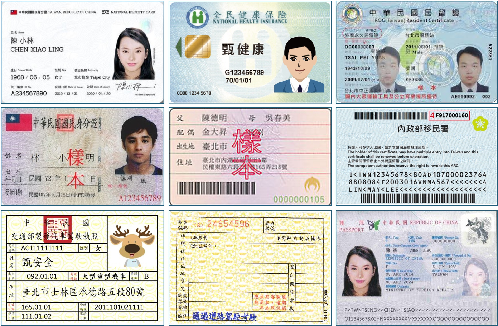
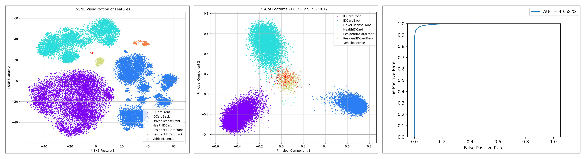
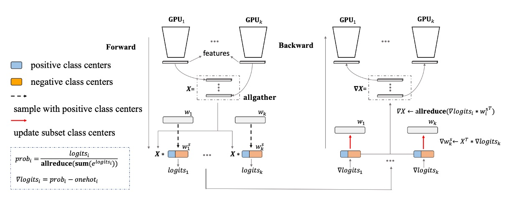

[English](./README.md) | **[中文](./README_cn.md)**

# DocClassifier

<p align="left">
    <a href="./LICENSE"></a>
    <a href="https://github.com/DocsaidLab/DocClassifier/releases"></a>
    <a href=""></a>
    <a href="https://doi.org/10.5281/zenodo.10538356"></a>
</p>

## Introduction

<div align="center">
    
</div>

DocClassifier is a document image classification system designed to address challenges encountered by traditional classifiers when processing text images. Drawing inspiration from facial recognition technology, it is particularly well-suited for scenarios requiring quick identification and addition of text types, such as in fintech, banking, and the sharing economy.

The system employs the PartialFC feature learning architecture, incorporating technologies like CosFace and ArcFace, enabling it to classify accurately without the need for a pre-set large number of categories. To allow the model to learn diverse features, we collected approximately 650 text images and 16,000 images for scene classification, expanding the dataset to about 400,000 categories through image augmentation techniques.

In terms of technology selection, PyTorch is used as the primary training platform, with ONNXRuntime facilitating model inference to ensure efficient operation on both CPUs and GPUs. We also support converting models to ONNX format for easy deployment across different platforms. For scenarios requiring model quantization, we offer quantization capabilities based on the ONNXRuntime API to enhance the model's operational efficiency and flexibility.

In testing, our model demonstrated an accuracy rate of over 99% using a zero-shot training strategy (TPR@FPR=1e-1). Importantly, DocClassifier allows for the quick addition of document types without the need for retraining, akin to the registration process in facial recognition systems, thereby enhancing the system's adaptability and scalability. In practical applications, our model not only achieved real-time inference speeds but also met the needs of the vast majority of application scenarios.

---

## Table of Contents

- [Introduction](#introduction)
- [Table of Contents](#table-of-contents)
- [Quick Start](#quick-start)
- [Benchmark](#benchmark)
- [Training the Model](#training-the-model)
- [Model Architecture Design](#model-architecture-design)
- [Dataset](#dataset)
- [Dataset Implementation](#dataset-implementation)
- [Building the Training Environment](#building-the-training-environment)
- [Running Training (Based on Docker)](#running-training-based-on-docker)
- [Convert to ONNX Format](#convert-to-onnx-format)
- [Dataset Submission](#dataset-submission)
- [Frequently Asked Questions (FAQs)](#frequently-asked-questions-faqs)
- [Citation](#citation)

---

## Quick Start

### Installation

Currently, we do not provide an installation package on Pypi. If you want to use this project, you can clone it directly from GitHub and then install the required dependencies. Before installing, please ensure that you have already installed [DocsaidKit](https://github.com/DocsaidLab/DocsaidKit).

If you have already installed DocsaidKit, please follow the steps below:

1. Clone the Project:

   ```bash
   git clone https://github.com/DocsaidLab/DocClassifier.git
   ```

2. Enter the Project Directory:

   ```bash
   cd DocClassifier
   ```

3. Create Packaging Files:

   ```bash
   python setup.py bdist_wheel
   ```

4. Install the Packaged Files:

   ```bash
   pip install dist/docclassifier-*-py3-none-any.whl
   ```

By following these steps, you should be able to successfully complete the installation of DocClassifier.

Once the installation is complete, you can start using the project.

---

### Importing Necessary Dependencies

We provide a simple model inference interface that includes the logic for preprocessing and postprocessing.

First, you need to import the required dependencies and create the DocClassifier class.

```python
import docsaidkit as D
from docsaidkit import Backend
from docclassifier import DocClassifier
```

### Register

In the inference folder directory, there is a `register` folder that contains all the registration data. You can place your registration data in it, and during inference, specifying `register` will prompt the DocClassifier to automatically read all the data in the folder.

If you wish to use your own dataset, when creating the `DocClassifier`, please specify the `register_root` parameter and set it as the root directory of your dataset. We recommend using full-page images for your data to minimize background interference, thereby enhancing the stability of the model.

We have pre-installed several document images and their registration data in the module for your reference, and you are welcome to expand upon these resources. At the same time, we strongly recommend using your own dataset to ensure that the model adapts well to your application scenario. For example, many of the images pre-installed in the folder are of low resolution, which can lead to inaccurate results during model inference.

<div align="center">
    
</div>

---

**Special Note: If you register the same image multiple times, it will definitely corrupt the model. Therefore, take your registration data seriously and ensure they are correct.**

---

### ModelType

`ModelType` is an enumeration type used to specify the model type used by DocClassifier. It includes the following options:

- `margin_based`: Uses a model architecture based on the margin method.

There may be more model types in the future, and we will update here.

### Backend

`Backend` is an enumeration type used to specify the computational backend of DocClassifier. It includes the following options:

- `cpu`: Uses CPU for computation.
- `cuda`: Uses GPU for computation (requires appropriate hardware support).

ONNXRuntime supports a wide range of backends, including CPU, CUDA, OpenCL, DirectX, TensorRT, etc. If you have other requirements, you can refer to [**ONNXRuntime Execution Providers**](https://onnxruntime.ai/docs/execution-providers/index.html) and modify it to the corresponding backend accordingly.

### Creating a `DocClassifier` Instance

```python
model = DocClassifier(
    gpu_id=0,  # GPU ID, set to -1 if not using GPU
    backend=Backend.cpu,  # Choose the computation backend, can be Backend.cpu or Backend.cuda
    threshold=0.5,  # Threshold for model prediction, each model has a default value, no need to set if not adjusting
    register_root='path/to/your/register',  # Root directory for the registration data, default is register
)
```

Notes:

- Using CUDA for computation requires not only appropriate hardware support but also the installation of the corresponding CUDA drivers and CUDA Toolkit. If your system does not have CUDA installed, or if the installed version is incorrect, the CUDA computation backend cannot be used.

- For issues related to ONNXRuntime installation dependencies, please refer to [ONNXRuntime Release Notes](https://onnxruntime.ai/docs/execution-providers/CUDA-ExecutionProvider.html#requirements).

### Reading and Processing Images

```python
# Reading the image
img = D.imread('path/to/your/image.jpg')

# Using the model for inference
# Here, most_similar is the most similar category, max_score is the highest score
most_similar, max_score = model(img)
```

### Output Results

The inference result you get is based on the registered dataset within the module. The model will find the most similar category from it and output the label and score of the category.

```python
import docsaidkit as D
from docclassifier import DocClassifier

model = DocClassifier(backend=D.Backend.cpu)
img = D.imread('docs/test_driver.jpg')
most_similar, max_score = model(img)
print(f'most_similar: {most_similar}, max_score: {max_score:.4f}')
# >>> most_similar: Taiwanese Driver's License Front, max_score: 0.7334
```

- **most_similar: Taiwanese Driver's License Front, max_score: 0.7334**

    <div>
        
    </div>

### Model Threshold Setting

While we adopt the TPR@FPR=1e-4 standard in assessing the capabilities of our model, and our deployment program also defaults to the values corresponding to this standard, in reality, this criterion is relatively strict. It can lead to a less favorable user experience during deployment. Therefore, we suggest using the TPR@FPR=1e-1 or TPR@FPR=1e-2 threshold settings for deployment.

For related tables, please refer to the explanation section in [Evaluation Results](#evaluation-results).

---

## Benchmark

We have an internal test dataset, but due to privacy protection, we cannot make this dataset open source. We can only provide evaluation results based on this dataset.

### Evaluation Protocol

1. **AUROC**

    AUROC (Area Under the Receiver Operating Characteristic Curve) is a statistical metric used to evaluate the performance of classification models, especially in binary classification problems. The range of AUROC values is from 0 to 1, where a higher AUROC value indicates better ability of the model to distinguish between two classes.

    - **ROC Curve**

        1. **Definition**: The ROC curve is a graphical tool for evaluating the performance of classification models at all possible classification thresholds. It achieves this by plotting the True Positive Rate (TPR) against the False Positive Rate (FPR) at various thresholds.

        2. **True Positive Rate (TPR)**: Also known as sensitivity, calculated as TPR = TP / (TP + FN), where TP is the number of true positives, and FN is the number of false negatives.

        3. **False Positive Rate (FPR)**: Calculated as FPR = FP / (FP + TN), where FP is the number of false positives, and TN is the number of true negatives.

    - **AUROC Calculation**

        1. AUROC is the area under the ROC curve. It provides a single metric to summarize the model's performance across all possible classification thresholds.

        2. **Analysis**:
            - **AUROC = 1**: Perfect classifier, able to completely distinguish between the two classes.
            - **0.5 < AUROC < 1**: The model has the ability to differentiate between two classes, and the closer the AUROC value is to 1, the better the performance of the model.
            - **AUROC = 0.5**: No discriminative ability, equivalent to random guessing.
            - **AUROC < 0.5**: Worse than random guessing, but if the model's predictions are interpreted inversely (predicting positive class as negative and vice versa), it may perform better.

2. **TPR@FPR Threshold Table**

    The TPR@FPR Threshold Table is a key evaluation tool widely used in the field of facial recognition. Its primary purpose is to measure the performance of models under different threshold settings. Derived from the ROC (Receiver Operating Characteristic) curve, this table offers an intuitive and precise method for assessing model efficacy. For example, if the goal is to achieve a TPR (True Positive Rate) of at least 0.9 at an FPR (False Positive Rate) of 0.01, the corresponding threshold can be identified using the TPR-FPR Threshold Table. This threshold then guides the inference process of the model.

    In the task of document recognition, we have adopted a similar evaluation method. We have chosen the performance of TPR at an FPR of 0.0001 as our standard. This standard assists us in understanding the model's performance under specific conditions more accurately.

3. **Zero-shot Testing**

    We adopt a zero-shot testing strategy, ensuring that all categories or patterns in the test data do not appear in the training data. This means that during the training phase of the model, it has never encountered or learned any samples or categories from the test set. The purpose of this is to evaluate and validate the model's generalization ability and identification performance when faced with completely unknown data.

    This testing method is particularly suitable for evaluating Zero-shot Learning models, as the core challenge of zero-shot learning is to deal with categories that the model has never seen during training. In the context of zero-shot learning, the model typically needs to utilize other forms of auxiliary information (such as textual descriptions of categories, attribute labels, or semantic associations between categories) to understand new categories. Therefore, in zero-shot testing, the model must rely on the knowledge it has learned from the training categories and the potential associations between categories to identify new samples in the test set.

### Evaluation Results

- **Global settings**

    - Num of classes: 394,080
    - Num of epochs: 20
    - Num of data per epoch: 2,560,000
    - Batch Size: 512
    - Optimizer: AdamW
    - Setting:
        - flatten: Flatten -> Linear (Default)
        - gap: GlobalAveragePooling2d -> Linear
        - squeeze: Conv2d -> Flatten -> Linear

- **Comprehensive comparison**

    <div align="center">

    | Name | TPR@FPR=1e-4 | ROC | FLOPs (G) | Size (MB) |
    | --- | :---: | :---: | :---: | :---: |
    | lcnet050-f256-r128-ln-arc | 0.754 | 0.9951 | 0.053 | 5.54 |
    | lcnet050-f256-r128-ln-softmax | 0.663 | 0.9907 | 0.053 | 5.54 |
    | lcnet050-f256-r128-ln-cos | **0.784** | **0.9968** | 0.053 | 5.54 |
    | lcnet050-f256-r128-ln-cos-from-scratch | 0.141 | 0.9273 | 0.053 | 5.54 |
    | lcnet050-f256-r128-ln-cos-squeeze | 0.772 | 0.9958 | 0.052 | **2.46** |
    | lcnet050-f256-r128-bn-cos | 0.721 | 0.992 | 0.053 | 5.54 |
    | lcnet050-f128-r96-ln-cos | 0.713 | 0.9944 | 0.029 | 2.33 |
    | lcnet050-f256-r128-ln-cos-gap | 0.480 | 0.9762 | 0.053 | 2.67 |
    | efficientnet_b0-f256-r128-ln-cos | 0.682 | 0.9931 | 0.242 | 19.89 |

    </div>

- **Comparison Based on the Number of Target Classes**

    <div>

    | Name | Num_Classes | TPR@FPR=1e-4 | ROC |
    | --- | ---: | :---: | :---: |
    | lcnet050-f256-r128-ln-arc |  16,256 | 0.615 | 0.9867 |
    | lcnet050-f256-r128-ln-arc | 130,048 | 0.666 | 0.9919 |
    | lcnet050-f256-r128-ln-arc | 390,144 | **0.754** | **0.9951** |

    </div>

    - The more classes there are, the better the model performs.

- **MarginLoss Comparison**

    <div>

    | Name | TPR@FPR=1e-4 | ROC |
    | --- | :---: | :---: |
    | lcnet050-f256-r128-ln-softmax | 0.663 | 0.9907 |
    | lcnet050-f256-r128-ln-arc | 0.754 | 0.9951 |
    | lcnet050-f256-r128-ln-cos | **0.784** | **0.9968** |

    </div>

    - Using CosFace or ArcFace alone, ArcFace performs better.
    - With PartialFC, CosFace performs better.

- **BatchNorm vs LayerNorm**

    <div>

    | Name | TPR@FPR=1e-4 | ROC |
    | --- | :---: | :---: |
    | lcnet050-f256-r128-bn-cos | 0.721 | 0.9921 |
    | lcnet050-f256-r128-ln-cos | **0.784** | **0.9968** |

    </div>

    - Using LayerNorm yields better results than BatchNorm.

- **Pretrain vs From-Scratch**

    <div>

    | Name | TPR@FPR=1e-4 | ROC |
    | --- | :---: | :---: |
    | lcnet050-f256-r128-ln-cos-from-scratch | 0.141 | 0.9273 |
    | lcnet050-f256-r128-ln-cos | **0.784** | **0.9968** |

    </div>

    - Using Pretrain is necessary and can save us a lot of time.

- **Ways to reduce model size**

    <div>

    | Name | TPR@FPR=1e-4 | ROC | Size (MB) | FLOPs (G) |
    | --- | :---: | :---: | :---: | :---: |
    | lcnet050-f256-r128-ln-cos | **0.784** | **0.9968** |  5.54 | 0.053 |
    | lcnet050-f256-r128-ln-cos-squeeze | 0.772 | 0.9958 | **2.46** | **0.053** |
    | lcnet050-f256-r128-ln-cos-gap | 0.480 | 0.9762 | 2.67 | 0.053 |
    | lcnet050-f128-r96-ln-cos | 0.713 | 0.9944 | 2.33 | 0.029 |

    </div>

    - Methods:
        - flatten: Flatten -> Linear (Default)
        - gap: GlobalAveragePooling2d -> Linear
        - squeeze: Conv2d -> Flatten -> Linear
        - Reduce resolution and feature dimensions
    - Use the squeeze method, which reduces the model size by half, although it sacrifices a little performance.
    - Using the gap method, the accuracy is greatly reduced.
    - Reduce the resolution and feature dimensions, and the accuracy will be slightly reduced.

- **Increase Backbone**

    <div>

    | Name | TPR@FPR=1e-4 | ROC |
    | --- | :---: | :---: |
    | lcnet050-f256-r128-ln-cos | **0.784** | **0.9968** |
    | efficientnet_b0-f256-r128-ln-cos | 0.682 | 0.9931 |

    </div>

    - As the number of parameters increases, the effect decreases. We believe this is related to the data diversity of the training data set. Since our approach does not provide much diversity, increasing the number of parameters does not improve the performance.

- **Using ImageNet1K as the Base Class**

    <div>

    | Name | Dataset | Num_Classes | TPR@FPR=1e-4 | ROC |
    | --- | :---: | :---: | :---: | :---: |
    | lcnet050-f256-r128-ln-cos-squeeze | Indoor | 390,144 | 0.772 | 0.9958 |
    | lcnet050-f256-r128-ln-cos-squeeze | ImageNet-1K | 1,281,833 | **0.813** | **0.9961** |

    </div>

    - By using ImageNet-1K to expand the number of categories to approximately 1.3 million (without rotation augmentation, etc.), the model is given a richer variety of image changes, increasing data diversity and improving performance by 4%.


---

- **lcnet050-f256-r128-ln-cos results**

    - **TPR@FPR=1e-4: 0.784**

        <div align="center">

        |    FPR    |  1e-05  |  1e-04  |  1e-03  |  1e-02  |  1e-01  |   1     |
        | :-------: | :-----: | :-----: | :-----: | :-----: | :-----: | :-----: |
        |    TPR    |  0.673  |  0.784  |  0.879  |  0.950  |  0.992  |   1.0   |
        | Threshold |  0.751  |  0.726  |  0.697  |  0.663  |  0.608  |  0.341  |

        </div>

    - **TSNE & PCA & ROC Curve**

        <div align="center">
            
        </div>

- **lcnet050-f256-r128-ln-cos-squeeze results**

    - **TPR@FPR=1e-4: 0.772**

        <div align="center">

        |    FPR    |  1e-05  |  1e-04  |  1e-03  |  1e-02  |  1e-01  |   1     |
        | :-------: | :-----: | :-----: | :-----: | :-----: | :-----: | :-----: |
        |    TPR    |  0.674  |  0.772  |  0.864  |  0.940  |  0.989  |   1.0   |
        | Threshold |  0.726  |  0.703  |  0.677  |  0.645  |  0.594  |  0.358  |

        </div>

    - **TSNE & PCA & ROC Curve**

        <div align="center">
            
        </div>

### Discussion of Results

- You might consider using a margin loss, such as CosFace or ArcFace. However, regardless of the choice, it's crucial to pair it with [PartialFC](https://arxiv.org/abs/2203.15565) to significantly increase training speed, stabilize convergence results, and improve performance. We would also like to express our special thanks to the implementation by [insightface](https://github.com/deepinsight/insightface) . If you have time, consider giving them a star.

- In terms of the variety of text images, we initially used about 500 types, which was later increased to 800, 10,000, and so on. Ultimately, we decided to include the indoor dataset as a base, expanding the overall classification categories to approximately 400,000. Our conclusion here aligns with the task of face recognition: the effectiveness of a model is greatly related to the diversity of the training data. Therefore, we need to use a large dataset to ensure that the model can learn enough features and effectively distinguish between different categories.

- Through experimentation, we found that using **low-precision training** enhances the model's generalization capabilities. This is attributed to the model's propensity for overfitting; low-precision training effectively mitigates this issue. Implementing low-precision directly in the `trainer` is infeasible due to the lack of support for certain operators in CUDA. Therefore, we employed `torch.set_float32_matmul_precision('medium')` as a method to achieve low-precision training.

- Through experiments, we found that using LayerNorm yielded better results than BatchNorm in the task of text image classification. We believe this is because text images (such as street signs, document images, etc.) usually contain highly variable features like different fonts, sizes, background noise, etc. LayerNorm, by standardizing each sample independently, helps the model handle these variations more effectively. In contrast, in face recognition, using BatchNorm helps the model learn to recognize subtle differences from highly similar facial images. This is crucial for ensuring that the model can effectively recognize facial features under various conditions such as lighting, angles, and facial expressions.

- When using CosFace and ArcFace individually, we found that ArcFace performed better; however, the situation was completely different when paired with PartialFC, where CosFace performed better.

- Pretrain is necessary. We tried not to use Pretrain, but the effect was very poor. The reason may be that the diversity of the data set we provided is still not enough, so we need to use Pretrain to help the model learn more features. We thank the models provided by timm again, which saved us a lot of time and manpower.

- In the process of connecting the Backbone and Head, using `nn.Flatten` to capture all information and integrating it into the feature encoding layer with `nn.Linear` proves to be the most effective approach. However, the downside is that it requires a substantial amount of parameters — in scenarios where lightweight models are crucial, even an increase of 1MB in model size is considered significant. To address this, we experimented with two approaches. Firstly, we tried using `nn.GlobalAvgPool2d` to gather all information and then integrated it into the feature encoding layer with `nn.Linear`. Secondly, we applied `nn.Conv2d` to reduce the number of channels to a quarter of the original count, a step we refer to as **Squeeze**, followed by using `nn.Flatten` in combination with `nn.Linear` for integration into the feature encoding layer. Our experiments show that the **Squeeze** strategy is the right choice. This strategy not only effectively reduces the model size but also maintains its performance.

---

## Training the Model

We do not offer the functionality for fine-tuning the model, but you can use our training module to produce a model yourself. Below, we provide a complete training process to help you start from scratch.

Broadly, you need to follow several steps:

1. **Prepare the Dataset**: Collect and organize data suitable for your needs.
2. **Set Up the Training Environment**: Configure the required hardware and software environment.
3. **Execute Training**: Train the model using your data.
4. **Evaluate the Model**: Test the model's performance and make adjustments.
5. **Convert to ONNX Format**: For better compatibility and performance, convert the model to ONNX format.
6. **Assess Quantization Needs**: Decide if quantization of the model is needed to optimize performance.
7. **Integrate and Package the Model**: Incorporate the ONNX model into your project.

Let's now break down the training process step-by-step.

---

## Model Architecture Design

### Margin Loss Model

<div align="center">
    
</div>

Reference: [ArcFace: Additive Angular Margin Loss for Deep Face Recognition](https://arxiv.org/pdf/1801.07698.pdf)

---

- **Backbone: LCNet**

    The backbone is the main body of the model, responsible for extracting features from input data.

    In this model, LCNet, a lightweight convolutional neural network, is used as the backbone. It is particularly suited for efficient feature extraction in environments with limited computational resources. The backbone is expected to extract sufficient feature information from the input data to prepare for subsequent metric learning.

- **Head: Linear**

    The head is the output layer of the model, responsible for transforming the features extracted by the backbone into output classes.

    In this model, a simple linear layer is used. This layer transforms the input feature vector into a probability distribution of output classes. Unlike typical linear classification, we will use loss functions designed for metric learning, such as CosFace or ArcFace, later in the process. Therefore, the output features are applied with a normalize function to fit subsequent calculations.

- **Loss: Margin Loss**

    CosFace is a loss function used in deep learning for face recognition tasks. Its design principle focuses on optimizing inter-class and intra-class distances to enhance the distinguishability between categories in the feature space, thereby improving the discriminative power of the learned features.

    CosFace primarily relies on cosine similarity rather than traditional Euclidean distance. Cosine similarity is more effective in handling high-dimensional features as it focuses on the angular difference between vectors, not their magnitude. CosFace normalizes the feature vectors, making the length of each feature vector equal to 1. This normalization ensures that the model focuses on the direction of features, i.e., the angular difference, rather than the absolute size of the feature vectors. An additional margin is introduced when calculating the cosine similarity between classes. The purpose of this margin is to push apart the features of different classes in the cosine space, making the features of the same class more closely clustered, while those of different classes are more dispersed.

    - **Mathematical Expression:**

        Let $`x_i`$ be a normalized feature vector, $`y_i`$ its corresponding class label, and $`W_{y_i}`$ the normalized weight vector associated with class $`y_i`$. CosFace is based on the cosine similarity between $`x_i`$ and $`W_{y_i}`$, with a margin $`m`$ introduced:

        $` L = -\frac{1}{N}\sum_{i=1}^{N}\log\frac{e^{s(\cos(\theta_{y_i}) - m)}}{e ^{s(\cos(\theta_{y_i}) - m)} + \sum_{j \neq y_i}e^{s\cos(\theta_j)}} `$

        Here, $`\theta_{y_i}`$ and $`\theta_j`$ are the angles between $`x_i`$ and $`W_{y_i}`$, and between $`x_i`$ and other class weight vectors, respectively. $`s`$ is a scaling parameter that controls the steepness of the decision boundary.

    CosFace enhances the performance of face recognition tasks by introducing an inter-class margin and optimizing the intra-class compactness in the feature space. It focuses on the direction of feature vectors, rather than their size, making the model more adept at learning features that differentiate between categories.

    On the other hand, ArcFace proposes a method called Additive Angular Margin Loss. The design concept of ArcFace is similar to that of CosFace, but the margin introduced in the calculation process is slightly different. ArcFace adds the margin directly in the angular space, rather than in the cosine function. This approach increases the geometric margin in the feature space, further promoting the separation of features between classes and the aggregation of features within classes. Specifically, ArcFace adjusts the way the angle between feature vectors and their corresponding class weight vectors is calculated, thereby effectively improving identification accuracy.

    Mathematically, the loss function of ArcFace can be expressed as:

    $` L = -\frac{1}{N}\sum_{i=1}^{N}\log\frac{e^{s(\cos(\theta_{y_i} + m))}}{e^{s(\cos(\theta_{y_i} + m))} + \sum_{j \neq y_i}e^{s\cos(\theta_j)}} `$

    Here, $`\theta_{y_i}`$ and $`\theta_j`$ are the angles between $`x_i`$ and $`W_{y_i}`$, and between $`x_i`$ and other class weight vectors, respectively. $`s`$ is a scaling parameter that controls the steepness of the decision boundary.

### PartialFC

<div align="center">
    
</div>

- **Reference**: [Partial FC: Training 10 Million Identities on a Single Machine](https://arxiv.org/pdf/2010.05222.pdf)

    - The structure of PartialFC's distributed implementation. k represents the number of GPUs.
    - Allgather: Collects data from all GPUs and distributes the combined data to all GPUs.
    - Allreduce: Sums the data and distributes the result to all GPUs.

PartialFC is an efficient distributed sampling algorithm specifically designed to address memory limitations in large-scale facial recognition systems. This method reduces the demand on GPU memory effectively by training only on a randomly selected subset of classes, while maintaining recognition accuracy. With PartialFC, it is possible to handle identity recognition tasks involving tens of millions of identities, even with limited hardware resources. The implementation of this algorithm not only enhances training efficiency but also opens new possibilities for the development of large-scale facial recognition technologies.

---

## Dataset

The majority of the text and image data were collected through internet searches.

Apart from internet searches, we have gathered some text and image data from the following datasets:

- **Indoor Scenes**
   - [**Indoor**](https://web.mit.edu/torralba/www/indoor.html)
   - This dataset contains 67 indoor categories, with a total of 15,620 images. The number of images varies per category, but each category has at least 100 images. All images are in jpg format.

   We removed a few damaged images from this dataset and defined each image as a category, obtaining a total of 15,590 images.

In the end, we collected 16,256 images as a base, and defined the following transformation methods:

- Original image
- Rotation by 90 degrees
- Rotation by 180 degrees
- Rotation by 270 degrees

With 'vertical flip' and 'cropping' transformations, one image can constitute 24 types, thus we have approximately 400,000 text categories in total.

Note that 'vertical flip' and 'horizontal flip' are mutually exclusive because combining them with rotations of 90, 180, and 270 degrees will result in the same image.

Here is a brief demonstration of the expansion logic:

```python
def _build_dataset(self):

    if not (fp := DIR.parent / 'data' / 'indoor_cache.json').is_file():
        fs_ind = D.get_files(INDOOR_ROOT, suffix=['.jpg', '.png', '.jpeg'])
        fs_ind_ = [str(f) for f in D.Tqdm(
            fs_ind, desc='Drop Empty images.') if D.imread(f) is not None]
        D.dump_json(fs_ind_, fp)
    else:
        fs_ind_ = D.load_json(fp)

    fs = D.get_files(self.root, suffix=['.jpg', '.png', '.jpeg'])

    dataset = []
    for label, f in enumerate(D.Tqdm(fs + fs_ind_, desc='Build Dataset')):

        img = D.imresize(
            img=D.imread(f),
            size=self.image_size,
            interpolation=self.interpolation
        )

        d01 = (label, img)
        d02 = (label * 24 + 1, D.imrotate(img, 90))
        d03 = (label * 24 + 2, D.imrotate(img, 180))
        d04 = (label * 24 + 3, D.imrotate(img, 270))
        d05 = (label * 24 + 4, cv2.flip(img, 0))
        d06 = (label * 24 + 5, cv2.flip(D.imrotate(img, 90), 0))
        d07 = (label * 24 + 6, cv2.flip(D.imrotate(img, 180), 0))
        d08 = (label * 24 + 7, cv2.flip(D.imrotate(img, 270), 0))
        d09 = (label * 24 + 8, d01[1][:img.shape[0] // 2, :, :])
        d10 = (label * 24 + 9, d02[1][:img.shape[0] // 2, :, :])
        d11 = (label * 24 + 10, d03[1][:img.shape[0] // 2, :, :])
        d12 = (label * 24 + 11, d04[1][:img.shape[0] // 2, :, :])
        d13 = (label * 24 + 12, d05[1][:img.shape[0] // 2, :, :])
        d14 = (label * 24 + 13, d06[1][:img.shape[0] // 2, :, :])
        d15 = (label * 24 + 14, d07[1][:img.shape[0] // 2, :, :])
        d16 = (label * 24 + 15, d08[1][:img.shape[0] // 2, :, :])
        d17 = (label * 24 + 16, d01[1][img.shape[0] // 2:, :, :])
        d18 = (label * 24 + 17, d02[1][img.shape[0] // 2:, :, :])
        d19 = (label * 24 + 18, d03[1][img.shape[0] // 2:, :, :])
        d20 = (label * 24 + 19, d04[1][img.shape[0] // 2:, :, :])
        d21 = (label * 24 + 20, d05[1][img.shape[0] // 2:, :, :])
        d22 = (label * 24 + 21, d06[1][img.shape[0] // 2:, :, :])
        d23 = (label * 24 + 22, d07[1][img.shape[0] // 2:, :, :])
        d24 = (label * 24 + 23, d08[1][img.shape[0] // 2:, :, :])

        dataset.extend([
            d01, d02, d03, d04, d05, d06, d07, d08,
            d09, d10, d11, d12, d13, d14, d15, d16,
            d17, d18, d19, d20, d21, d22, d23, d24
        ])

    return dataset
```

---

## Dataset Implementation

We have implemented datasets corresponding to PyTorch training based on the datasets mentioned above. Please refer to [dataset.py](./model/dataset.py).

The following shows how to load the dataset:

```python
import docsaidkit as D
from model.dataset import SyncDataset

ds = SyncDataset(
    image_size=(480, 800),
    return_tensor=False # If set to True, the returned data will be in the format of torch.Tensor for training.
)

img, label = ds[0]

D.imwrite(img, f'label_{label}.jpg')
```

<div align="center">
    
</div>

- Please note: This is a fully synthetic dataset, so we have implemented a mechanism for random image generation. Do not be surprised if the image you receive differs from the example shown above.

### Image Augmentation

Despite our best efforts to collect a variety of textual images, the quantity is still too limited. Essentially, we have only one image per sample. Therefore, we need to use image augmentation techniques to expand our dataset.

```python
class DefaultImageAug:

    def __init__(self, p=0.5):

        self.aug = A.Compose([

            DT.ShiftScaleRotate(
                shift_limit=0.1,
                scale_limit=0.1,
                rotate_limit=15,
            ),

            A.OneOf([
                A.MotionBlur(),
                A.MedianBlur(),
                A.GaussianBlur(),
                A.ZoomBlur(),
                A.Defocus(radius=(3, 5)),
                A.ImageCompression(quality_lower=0, quality_upper=50),
            ]),

            A.OneOf([
                A.ISONoise(),
                A.GaussNoise(),
                A.MultiplicativeNoise(
                    multiplier=[0.5, 1.5],
                    elementwise=True,
                    per_channel=True
                ),
            ]),

            A.OneOf([
                A.ColorJitter(
                    brightness=0.3,
                    contrast=0.1,
                    saturation=0.1,
                ),
                A.ToGray(),
                A.ToSepia(),
                A.ChannelShuffle(),
                A.ChannelDropout(),
                A.RGBShift(),
                A.InvertImg(),
            ]),

        ], p=p)

    def __call__(self, img: np.ndarray) -> Any:
        img = self.aug(image=img)['image']
        return img
```

- **ShiftScaleRotate**
  - Since we have already expanded our categories using flipping and 90-degree rotations, we cannot use extensive flipping or large-scale rotations here, as it would lead to category conflicts. In this case, we only perform slight modifications, specifically limited to minor rotations (plus or minus 15 degrees) and scaling adjustments (10% scale variation).

- **Others**
  - We did some noise, noise, brightness and color interference.

---

## Building the Training Environment

Firstly, ensure that you have built the base image `docsaid_training_base_image` from `DocsaidKit`.

If you haven’t done this yet, please refer to the documentation in `DocsaidKit`.

```bash
# Build base image from docsaidkit at first
git clone https://github.com/DocsaidLab/DocsaidKit.git
cd DocsaidKit
bash docker/build.bash
```

Next, use the following commands to build the Docker image for the DocClassifier task:

```bash
# Then build DocClassifier image
git clone https://github.com/DocsaidLab/DocClassifier.git
cd DocClassifier
bash docker/build.bash
```

Here is our default [Dockerfile](./docker/Dockerfile), specifically designed for document alignment training. We've included a brief explanation for the file, which you can modify according to your needs:

1. **Base Image**
    - `FROM docsaid_training_base_image:latest`
    - This line specifies the base image for the container, the latest version of `docsaid_training_base_image`. The base image is like the starting point for building your Docker container; it contains a pre-configured operating system and some basic tools. You can find it in the `DocsaidKit` project.

2. **Working Directory Setup**
    - `WORKDIR /code`
    - This sets the container's working directory to `/code`. The working directory is a directory inside the Docker container where your application and all commands will operate.

3. **Environment Variable**
    - `ENV ENTRYPOINT_SCRIPT=/entrypoint.sh`
    - This line defines an environment variable `ENTRYPOINT_SCRIPT` with the value `/entrypoint.sh`. Environment variables are used to store common configurations and can be accessed anywhere in the container.

4. **Installing gosu**
    - The `RUN` command is used to install `gosu`. `gosu` is a lightweight tool that allows a user to execute commands with a specific user identity, similar to `sudo` but more suited for Docker containers.
    - `apt-get update && apt-get install -y gosu && rm -rf /var/lib/apt/lists/*` This command updates the package list, installs `gosu`, and then cleans up unnecessary files to reduce the image size.

5. **Creating Entry Point Script**
    - The entry point script `/entrypoint.sh` is created using a series of `RUN` commands.
    - This script first checks whether the environment variables `USER_ID` and `GROUP_ID` are set. If set, the script creates a new user and group, and executes commands as that user.
    - This is very useful for handling file permission issues inside and outside of the container, especially when the container needs to access files on the host machine.

6. **Setting Permissions**
    - `RUN chmod +x "$ENTRYPOINT_SCRIPT"` This command makes the entry point script executable.

7. **Setting Container Entry Point and Default Command**
    - `ENTRYPOINT ["/bin/bash", "/entrypoint.sh"]` and `CMD ["bash"]`
    - These commands specify the default command executed when the container starts. When the container is launched, it will execute the `/entrypoint.sh` script.

---

## Running Training (Based on Docker)

Here's how you can use your pre-built Docker image to run document classification training.

First, take a look at the contents of the `train.bash` file:

```bash
#!/bin/bash

cat > trainer.py <<EOF
from fire import Fire
from DocClassifier.model import main_docclassifier_train

if __name__ == '__main__':
    Fire(main_docclassifier_train)
EOF

docker run \
    -e USER_ID=$(id -u) \
    -e GROUP_ID=$(id -g) \
    --gpus all \
    --shm-size=64g \
    --ipc=host --net=host \
    --cpuset-cpus="0-31" \
    -v $PWD/DocClassifier:/code/DocClassifier \
    -v $PWD/trainer.py:/code/trainer.py \
    -v /data/Dataset:/data/Dataset \ # Replace with your dataset directory
    -it --rm doc_classifier_train python trainer.py --cfg_name $1
```

Here is an explanation of the above file for your reference if you wish to make modifications:

1. **Creating a Training Script**
   - `cat > trainer.py <<EOF ... EOF`
   - This command creates a Python script `trainer.py`. This script imports necessary modules and functions and calls the `main_docclassifier_train` function in the script's main section. It uses Google's Python Fire library for parsing command-line arguments, making it easier to generate a command-line interface.

2. **Running a Docker Container**
   - `docker run ... doc_classifier_train python trainer.py --cfg_name $1`
   - This command launches a Docker container and runs the `trainer.py` script within it.
   - `-e USER_ID=$(id -u) -e GROUP_ID=$(id -g)`: These parameters pass the current user's user ID and group ID to the container to create a user with corresponding permissions inside the container.
   - `--gpus all`: Specifies that the container can use all GPUs.
   - `--shm-size=64g`: Sets the size of shared memory, which is useful for large-scale data processing.
   - `--ipc=host --net=host`: These settings allow the container to use the host's IPC namespace and network stack, which helps improve performance.
   - `--cpuset-cpus="0-31"`: Specifies which CPU cores the container should use.
   - `-v $PWD/DocClassifier:/code/DocClassifier` etc.: These are mount parameters, mapping directories from the host to inside the container for easy access to training data and scripts.
   - `--cfg_name $1`: This is the parameter passed to `trainer.py`, specifying the name of the configuration file.

3. **Dataset Path**
   - Pay special attention to `/data/Dataset`, which is the path for storing training data. You will need to adjust the `-v /data/Dataset:/data/Dataset` command to replace `/data/Dataset` with your dataset directory.

Finally, go to the parent directory of `DocClassifier` and run the following command to start training:

```bash
bash DocClassifier/docker/train.bash lcnet050_cosface_96 # Replace with your configuration file name
```

- Note: For an explanation of the configuration files, refer to [DocClassifier/model/README.md](./model/README.md).

By following these steps, you can safely run your document classification training tasks within a Docker container while leveraging Docker's isolated environment to ensure consistency and reproducibility. This approach makes the project's deployment and scaling more convenient and flexible.

Let me know if you need any more assistance!

---

## Convert to ONNX Format

This section describes how to convert your model to the ONNX format.

First, let's look at the contents of the `to_onnx.bash` file:

```bash
#!/bin/bash

cat > torch2onnx.py <<EOF
from fire import Fire
from DocClassifier.model import main_docclassifier_torch2onnx

if __name__ == '__main__':
    Fire(main_docclassifier_torch2onnx)
EOF

docker run \
    -e USER_ID=$(id -u) \
    -e GROUP_ID=$(id -g) \
    --shm-size=64g \
    --ipc=host --net=host \
    -v $PWD/DocClassifier:/code/DocClassifier \
    -v $PWD/torch2onnx.py:/code/torch2onnx.py \
    -it --rm doc_classifier_train python torch2onnx.py --cfg_name $1
```

Start from this file, but you don't need to modify it. Instead, you need to modify the corresponding file: `model/to_onnx.py`

During training, you might use many branches to supervise the training of the model, but during the inference stage, you may only need one of these branches. Therefore, we need to convert the model to ONNX format and retain only the branches needed for inference.

For example:

```python
class WarpFeatureLearning(nn.Module):

    def __init__(self, model: L.LightningModule):
        super().__init__()
        self.backbone = model.backbone
        self.head = model.head

    def forward(self, img: torch.Tensor):
        xs = self.backbone(img)
        features = self.head(xs)
        return features
```

In the example above, we only extract the branch used for inference and encapsulate it into a new model `WarpFeatureLearning`. Then, make corresponding parameter settings in the yaml config:

```yaml
onnx:
  name: WarpFeatureLearning
  input_shape:
    img:
      shape: [1, 3, 96, 96]
      dtype: float32
  input_names: ['img']
  output_names:
    - feats
  dynamic_axes:
    img:
      '0': batch_size
    output:
      '0': batch_size
  options:
    opset_version: 16
    verbose: False
    do_constant_folding: True
```

This specifies the model's input size, input names, output names, and the version of ONNX.

We have already written the conversion part for you. After completing the modifications above, make sure the `model/to_onnx.py` file is pointing to your model. Then, go back to the parent directory of `DocClassifier` and execute the following command to start the conversion:

```bash
bash DocClassifier/docker/to_onnx.bash lcnet050_cosface_96 # Replace with your configuration file name
```

At this point, you will see a new ONNX model in the `DocClassifier/model` directory. Move this model to the corresponding inference model directory under `docclassifier/xxx`, and you can proceed with inference.

---

## Dataset Submission

First, we sincerely appreciate your willingness to provide a dataset. We will test and integrate it as soon as possible.

In this task, you need to provide text templates without any borders or backgrounds, just like our open-source datasets.

You don't need to provide any labels; we will automatically label your dataset during the integration process.

We recommend that you upload the data to your Google Drive and provide us with the link through [email](docsaidlab@gmail.com). We will test and integrate your data as soon as we receive it. If the data you provide does not meet our requirements, we will notify you promptly.

- **Reasons for non-compliance may include**:
    - **Insufficient dataset accuracy**: For example, your dataset is not corrected full-page images but includes background noise.
    - **Low resolution of the dataset**: Although we only use images of size 128 x 128 in our training process, we expect the original image quality to not be too poor — at least recognizable to the naked eye. We believe this requirement is minimal, thanks for your understanding.

---

## Frequently Asked Questions (FAQs)

1. **Will the quality of my submission improve the model's performance?**
   - It's hard to say. Even though our model will be exposed to the data you provide, this does not mean that the characteristics of this data will have a significant impact on the model. It's better to have seen the data than not at all, but this does not necessarily lead to substantial improvement.

2. **How important is the file name?**
   - The file name is not a primary concern, as long as it correctly links to the corresponding image.

3. **Any recommendations for image format?**
   - We recommend using the jpg format to save space.

If you need more help, please contact us via email: **docsaidlab@gmail.com**

---

## Citation

If you find our work helpful, please cite the following related papers:

```bibtex
@misc{lin2024docclassifier,
  author = {Kun-Hsiang Lin, Ze Yuan},
  title = {DocClassifier},
  year = {2024},
  publisher = {GitHub},
  journal = {GitHub repository},
  doi = {10.5281/zenodo.10538356},
  howpublished = {\url{https://github.com/DocsaidLab/DocClassifier}}
}

@misc{rw2019timm,
  author = {Ross Wightman},
  title = {PyTorch Image Models},
  year = {2019},
  publisher = {GitHub},
  journal = {GitHub repository},
  doi = {10.5281/zenodo.4414861},
  howpublished = {\url{https://github.com/rwightman/pytorch-image-models}}
}

@misc{gpiosenka_cards_2023,
  author = {Gerry},
  title = {{Cards Image Dataset for Classification}},
  year = {2023},
  howpublished = {\url{https://www.kaggle.com/datasets/gpiosenka/cards-image-datasetclassification?resource=download}},
  note = {Accessed: 2024-01-19},
  license = {CC0: Public Domain}
}

@inproceedings{deng2018arcface,
title={ArcFace: Additive Angular Margin Loss for Deep Face Recognition},
author={Deng, Jiankang and Guo, Jia and Niannan, Xue and Zafeiriou, Stefanos},
booktitle={CVPR},
year={2019}
}

@inproceedings{wang2018cosface,
  title={Cosface: Large margin cosine loss for deep face recognition},
  author={Wang, Hao and Wang, Yitong and Zhou, Zheng and Ji, Xing and Gong, Dihong and Zhou, Jingchao and Li, Zhifeng and Liu, Wei},
  booktitle={Proceedings of the IEEE conference on computer vision and pattern recognition},
  pages={5265--5274},
  year={2018}
}
```
