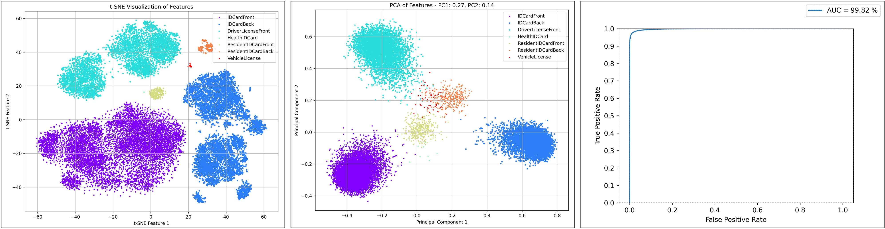
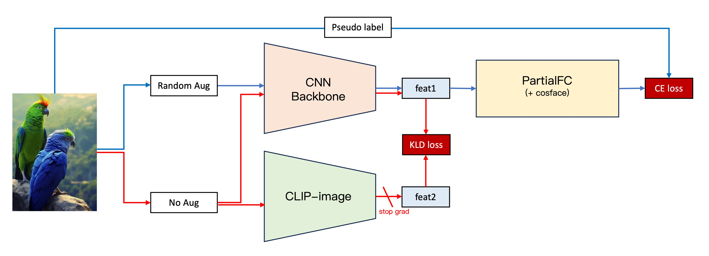

[English](./README.md) | **[中文](./README_cn.md)**

# DocClassifier

<p align="left">
    <a href="./LICENSE"></a>
    <a href="https://github.com/DocsaidLab/DocClassifier/releases"></a>
    <a href=""></a>
    <a href="https://doi.org/10.5281/zenodo.10538356"></a>
</p>

## 介紹

<div align="center">
    
</div>

DocClassifier 是一個基於度量學習（Metric Learning）技術的文件圖像分類系統，旨在解決傳統分類器處理文本圖像時遇到的文件類型快速增加且難以預先定義的問題。它借鑑了人臉辨識技術，尤其適合於需要迅速辨識和新增文本類型的場合，例如在金融科技、銀行和共享經濟等領域中。

在我們設計的基本實驗模型中使用了 PartialFC 特徵學習架構，結合了 CosFace 和 ArcFace 等技術，使其能在沒有預先設定大量分類的情況下，精準地進行分類。為了讓模型能學習到多樣化的特徵，我們收集了大約 650 張文本圖像和 16000 張用於場景分類的圖像，並通過圖像增強技術擴大數據集至約 40 萬類。

我們在更進一步的實驗中，引入了 ImageNet-1K 和 CLIP 模型。我們使用 ImageNet-1K 資料集作為基底類別，將類別擴充到約 130 萬類，給予模型更豐富的圖面變化，增加資料多樣性，在 TPR@FPR=1e-4 的比較基準中，比起原有的基線模型效果提高了約 4.1%（77.2%->81.3%）。若在 ImageNet-1K 的基礎上再引入 CLIP 模型，在訓練的過程中進行知識蒸餾，則效果可以在 TPR@FPR=1e-4 的比較基準中再往上提升約 4.6%（81.3%->85.9%）。

在技術選擇上，PyTorch 被用作主要的訓練平台，並通過 ONNXRuntime 進行模型的推論，確保了模型在 CPU 和 GPU 上都能高效運行。我們也支持將模型轉換為 ONNX 格式，方便在不同平台上部署。針對需要模型量化的情況，我們提供了基於 ONNXRuntime API 的量化功能，以提高模型的運行效率和靈活性。

在測試中，我們的模型展示了超過 99% 的準確率（TPR@FPR=1e-1），使用了 zero-shot 訓練策略。重要的是，DocClassifier 允許快速新增證件類型而無需重新訓練，類似於人臉辨識系統的註冊過程，這提高了系統的適應性和擴展性。在實際應用中，我們的模型不僅實現了即時推論速度，還滿足了絕大多數應用場景的需求。

---

## 目錄

- [介紹](#介紹)
- [目錄](#目錄)
- [快速開始](#快速開始)
- [評估模型（Benchmark）](#評估模型benchmark)
- [訓練模型](#訓練模型)
- [模型架構設計](#模型架構設計)
- [資料集介紹及預處理](#資料集介紹及預處理)
- [資料集實作](#資料集實作)
- [構建訓練環境](#構建訓練環境)
- [執行訓練（Based on Docker）](#執行訓練based-on-docker)
- [轉換模型為 ONNX 格式（Based on Docker）](#轉換模型為-onnx-格式based-on-docker)
- [提交資料集](#提交資料集)
- [常見問題（FAQs）](#常見問題faqs)
- [引用](#引用)

---

## 快速開始

### 安裝

目前我們沒有提供 Pypi 上的安裝包，若要使用本專案，您可以直接從 Github 上 clone 本專案，然後安裝相依套件，安裝前請確認您已經安裝了 [DocsaidKit](https://github.com/DocsaidLab/DocsaidKit)。

若已經安裝 DocsaidKit，請按照以下步驟進行：

1. Clone 專案：

   ```bash
   git clone https://github.com/DocsaidLab/DocClassifier.git
   ```

2. 進入專案目錄：

   ```bash
   cd DocClassifier
   ```

3. 建立打包文件：

   ```bash
   python setup.py bdist_wheel
   ```

4. 安裝打包文件：

   ```bash
   pip install dist/docclassifier-*-py3-none-any.whl
   ```

遵循這些步驟，您應該能夠順利完成 DocClassifier 的安裝。

安裝完成後即可以使用本專案。

---

### 導入必要的依賴項

我們提供了一個簡單的模型推論介面，其中包含了前後處理的邏輯。

首先，您需要導入所需的相關依賴並創建 DocClassifier 類別。


```python
import docsaidkit as D
from docsaidkit import Backend
from docclassifier import DocClassifier
```

### Register

在推論的資料夾目錄中，有一個 `register` 資料夾，裡面包含了所有的註冊資料，您可以在其中放置您的註冊資料，在推論時 `DocClassifier` 會自動讀取資料夾中的所有資料。

如果您要使用自己的資料集，在創建 `DocClassifier` 時，請指定 `register_root` 參數，並且將其設定為您的資料集根目錄。我們建議您的資料使用滿版的圖像，盡量減少背景的干擾，以提高模型的穩定性。

我們在模組內預設放了幾個文件圖像的註冊資料，您可以參考這些資料，並且自行擴充。同時，我們也強烈建議使用您自己的資料集，以確保模型能夠適應您的應用場景。舉例來說，我們預先放在資料夾內的許多影像的解析度都很低，從而導致在推論的時候模型容易得到錯誤的答案。

<div  align="center">
    
</div>

---

**特別注意：如果您將同一張圖片重複註冊多次，那百分之百會把模型弄壞，因此請認真對待您的註冊資料，確保他們是正確的。**

---

### ModelType

`ModelType` 是一個枚舉類型，用於指定 DocClassifier 使用的模型類型。它包含以下選項：

- `margin_based`：使用基於 margin 方法的模型架構。

未來可能會有更多的模型類型，我們會在此處更新。

### Backend

`Backend` 是一個枚舉類型，用於指定 DocClassifier 的運算後端。它包含以下選項：

- `cpu`：使用 CPU 進行運算。
- `cuda`：使用 GPU 進行運算（需要適當的硬體支援）。

ONNXRuntime 支援了非常多的後端，包括 CPU、CUDA、OpenCL、DirectX、TensorRT 等等，若您有其他需求，可以參考 [**ONNXRuntime Execution Providers**](https://onnxruntime.ai/docs/execution-providers/index.html)，並自行修改成對應的後端。

### 創建 `DocClassifier` 實例

```python
model = DocClassifier(
    gpu_id=0,  # GPU 編號，如果不使用 GPU 請設為 -1
    backend=Backend.cpu,  # 選擇運算後端，可以是 Backend.cpu 或 Backend.cuda
    threshold=0.5,  # 模型預測的閾值，每個模型都有預設值，如果不需要調整，可以不用設定
    register_root='path/to/your/register',  # 註冊資料的根目錄，預設為 register
)
```

注意事項：

- 使用 cuda 運算除了需要適當的硬體支援外，還需要安裝相應的 CUDA 驅動程式和 CUDA 工具包。如果您的系統中沒有安裝 CUDA，或安裝的版本不正確，則無法使用 CUDA 運算後端。

- 關於 onnxruntime 安裝依賴相關的問題，請參考 [ONNXRuntime Release Notes](https://onnxruntime.ai/docs/execution-providers/CUDA-ExecutionProvider.html#requirements)

### 讀取和處理圖像

```python
# 讀取圖像
img = D.imread('path/to/your/image.jpg')

# 使用模型進行推論
# 其中，most_similar 是最相似的類別，max_score 是最相似的分數
most_similar, max_score = model(img)
```

### 輸出結果

您得到的推論結果是基於模組內的註冊資料集，模型會從中找出最相似的類別，並且輸出類別的標籤和分數。

```python
import docsaidkit as D
from docclassifier import DocClassifier

model = DocClassifier(backend=D.Backend.cpu)
img = D.imread('docs/test_driver.jpg')
most_similar, max_score = model(img)
print(f'most_similar: {most_similar}, max_score: {max_score:.4f}')
# >>> most_similar: 台灣駕照正面, max_score: 0.7334
```

- **most_similar: 台灣駕照正面, max_score: 0.7334**

    <div>
        
    </div>

### 模型閾值設定

雖然我們在評估模型的能力上，採用 TPR@FPR=1e-4 的標準，並且我們的部署程式也預設使用該標準所對應的數值。但實際上這個標準相對嚴格，且在部署時候會要成比較不好的使用者體驗。因此我們建議在部署時，可以採用 TPR@FPR=1e-1 或 TPR@FPR=1e-2 的閾值設定。

相關表格請參考[評估結果](#評估結果)的說明章節。

---

## 評估模型（Benchmark）

我們的測試資料集，由提出本專案的客戶所提供。這份資料集包含大約 25,000 張經過「文本定位裁切」後的「去識別化」的圖像，包含七種不同的類別，其數量極度不均衡。數據中存在大量不同光影變化、模糊、反光、角點定位誤差所導致的裁切形變等。我們僅清洗該資料集的「錯誤類別標注」，而後將所有資料用於評估模型的效能。

受限於隱私保護，我們無法開源這份資料，僅提供基於這份資料的評估結果。

### 評估協議

1. **AUROC**

    AUROC (Area Under the Receiver Operating Characteristic Curve，接收者操作特徵曲線下面積) 是用於評估分類模型效能的統計指標，特別是在處理二分類問題時。AUROC 值的範圍從 0 到 1，一個較高的 AUROC 值表示模型具有較好的區分兩個類別的能力。

    - **ROC曲線**

        1. **定義**：ROC曲線是一個圖形化的評估工具，展示了分類模型在所有可能的分類閾值下的表現。 它透過將真正例率（TPR, True Positive Rate）和假正例率（FPR, False Positive Rate）在不同閾值下的值繪製在圖表中來實現。

        2. **真正例率（TPR）**：也被稱為敏感度，計算公式為 TPR = TP / (TP + FN)，其中TP是真正例的數量，FN是假負例的數量。

        3. **假正例率（FPR）**：計算公式為 FPR = FP / (FP + TN)，其中FP是假正例的數量，TN是真負例的數量。

    - **AUROC 的計算**

        1. AUROC 是 ROC 曲線下的面積。 它提供了一個單一的度量值來總結模型在所有可能的分類閾值下的表現。

        2. **分析**：
            - **AUROC = 1**：完美分類器，能夠完全區分兩個類別。
            - **0.5 < AUROC < 1**：模型具有區分兩個類別的能力，AUROC 值越接近 1，模型的效能越好。
            - **AUROC = 0.5**：無區分能力，相當於隨機猜測。
            - **AUROC < 0.5**：比隨機猜測還差，但如果模型預測反向解釋（將正類預測為負類，反之亦然），可能會有較好的效能。

2. **TPR@FPR 閾值表**

    TPR@FPR 閾值表是在人臉辨識領域中廣泛使用的一種關鍵評估工具，其主要用途是衡量模型在不同閾值設定下的表現。這種表格是基於 ROC 曲線衍生出來的，提供了一種直觀且精確的方法來評估模型效能。例如，若目標是在FPR（假陽性率）為 0.01 時達到至少 TPR（真陽性率）0.9 的效能，我們可以透過 TPR-FPR 閾值表來確定相對應的閾值。這個閾值進而指導模型推論的過程。

    在文本圖像辨識的任務中，我們也採納了類似的評估方法。我們選擇了 TPR 在 FPR 為 0.0001 時的表現作為標準，這樣的標準幫助我們更準確地理解模型在特定條件下的效能。

3. **Zero-shot Testing**

    我們採取零樣本測試策略，確保測試資料中的所有類別或樣態都沒有出現在訓練資料中。這意味著在模型的訓練階段，它未曾接觸或學習任何測試集的樣本或類別。 這樣做的目的是為了評估和驗證模型在面對完全未知的數據時的泛化能力和辨識性能。

    這種測試方法特別適用於評估零樣本學習（Zero-shot Learning）模型，因為零樣本學習的核心挑戰在於處理模型在訓練期間從未見過的類別。 在零樣本學習的脈絡中，模型通常需要利用其他形式的輔助資訊（如類別的文字描述、屬性標籤或類別間的語意關聯）來建立對新類別的理解。 因此，在零樣本測試中，模型必須依賴它從訓練類別中學到的知識，以及類別間的潛在關聯，來辨識測試集中的新樣本。

### 評估結果

- **Global settings**

    - Num of classes: 394,080
    - Num of epochs: 20
    - Num of data per epoch: 2,560,000
    - Batch Size: 512
    - Optimizer: AdamW
    - Setting:
        - flatten: Flatten -> Linear (Default)
        - gap: GlobalAveragePooling2d -> Linear
        - squeeze: Conv2d -> Flatten -> Linear

- **綜合比較**

    <div align="center">

    | Name | TPR@FPR=1e-4 | ROC | FLOPs (G) | Size (MB) |
    | --- | :---: | :---: | :---: | :---: |
    | lcnet050-f256-r128-ln-arc | 0.754 | 0.9951 | 0.053 | 5.54 |
    | lcnet050-f256-r128-ln-softmax | 0.663 | 0.9907 | 0.053 | 5.54 |
    | lcnet050-f256-r128-ln-cos | **0.784** | **0.9968** | 0.053 | 5.54 |
    | lcnet050-f256-r128-ln-cos-from-scratch | 0.141 | 0.9273 | 0.053 | 5.54 |
    | lcnet050-f256-r128-ln-cos-squeeze | 0.772 | 0.9958 | 0.052 | **2.46** |
    | lcnet050-f256-r128-bn-cos | 0.721 | 0.992 | 0.053 | 5.54 |
    | lcnet050-f128-r96-ln-cos | 0.713 | 0.9944 | 0.029 | 2.33 |
    | lcnet050-f256-r128-ln-cos-gap | 0.480 | 0.9762 | 0.053 | 2.67 |
    | efficientnet_b0-f256-r128-ln-cos | 0.682 | 0.9931 | 0.242 | 19.89 |

    </div>

- **目標類別數量比較**

    <div>

    | Name | Num_Classes | TPR@FPR=1e-4 | ROC |
    | --- | ---: | :---: | :---: |
    | lcnet050-f256-r128-ln-arc |  16,256 | 0.615 | 0.9867 |
    | lcnet050-f256-r128-ln-arc | 130,048 | 0.666 | 0.9919 |
    | lcnet050-f256-r128-ln-arc | 390,144 | **0.754** | **0.9951** |

    </div>

    - 類別數量越多，模型效果越好。

- **MarginLoss 比較**

    <div>

    | Name | TPR@FPR=1e-4 | ROC |
    | --- | :---: | :---: |
    | lcnet050-f256-r128-ln-softmax | 0.663 | 0.9907 |
    | lcnet050-f256-r128-ln-arc | 0.754 | 0.9951 |
    | lcnet050-f256-r128-ln-cos | **0.784** | **0.9968** |

    </div>

    - 單獨使用 CosFace 或 ArcFace 時，ArcFace 效果好。
    - 搭配 PartialFC 後，CosFace 效果好。

- **BatchNorm vs LayerNorm**

    <div>

    | Name | TPR@FPR=1e-4 | ROC |
    | --- | :---: | :---: |
    | lcnet050-f256-r128-bn-cos | 0.721 | 0.9921 |
    | lcnet050-f256-r128-ln-cos | **0.784** | **0.9968** |

    </div>

    - 使用 LayerNorm 效果優於 BatchNorm。

- **Pretrain vs From-Scratch**

    <div>

    | Name | TPR@FPR=1e-4 | ROC |
    | --- | :---: | :---: |
    | lcnet050-f256-r128-ln-cos-from-scratch | 0.141 | 0.9273 |
    | lcnet050-f256-r128-ln-cos | **0.784** | **0.9968** |

    </div>

    - 使用 Pretrain 是必要的，可以節省我們大量的時間。

- **降低模型規模的方法**

    <div>

    | Name | TPR@FPR=1e-4 | ROC | Size (MB) | FLOPs (G) |
    | --- | :---: | :---: | :---: | :---: |
    | lcnet050-f256-r128-ln-cos | **0.784** | **0.9968** |  5.54 | 0.053 |
    | lcnet050-f256-r128-ln-cos-squeeze | 0.772 | 0.9958 | **2.46** | **0.053** |
    | lcnet050-f256-r128-ln-cos-gap | 0.480 | 0.9762 | 2.67 | 0.053 |
    | lcnet050-f128-r96-ln-cos | 0.713 | 0.9944 | 2.33 | 0.029 |

    </div>

    - 方法：
        - flatten: Flatten -> Linear (Default)
        - gap: GlobalAveragePooling2d -> Linear
        - squeeze: Conv2d -> Flatten -> Linear
        - 降低解析度和特徵維度
    - 使用 squeeze 方法，雖犧牲一點效能，但減少一半的模型大小。
    - 使用 gap 方法，準確度大幅降低。
    - 降低解析度和特徵維度，準確度小幅降低。

- **加大 Backbone**

    <div>

    | Name | TPR@FPR=1e-4 | ROC |
    | --- | :---: | :---: |
    | lcnet050-f256-r128-ln-cos | **0.784** | **0.9968** |
    | efficientnet_b0-f256-r128-ln-cos | 0.682 | 0.9931 |

    </div>

    - 參數量增加，效果降低，我們認為這個跟訓練資料集的資料多樣性有關。由於我們所採用的方式無法提供太多的多樣性，因此增加參數量並不能提高效果。

- **引入 ImageNet1K 資料集及使用 CLIP 模型進行知識蒸餾**

    由於資料集規模擴大，原本的設定參數已經無法順利地讓模型收斂，因此我們對模型進行了一些調整。

    - **Settings**
        - Num of classes: 1,281,833
        - Num of epochs: 20
        - Num of data per epoch: 25,600,000 (如果模型無法順利收斂，可能是資料量不足。)
        - Batch Size: 1024
        - Optimizer: AdamW
        - Learning Rate: 0.001
        - Learning Rate Scheduler: PolynomialDecay
        - Setting:
            - squeeze: Conv2d -> Flatten -> Linear

    ---

    <div>

    | Name | Dataset | with CLIP | Num_Classes | TPR@FPR=1e-4 | ROC |
    | --- | :---: | :---: | :---: | :---: | :---: |
    | lcnet050-f256-r128-ln-cos-squeeze | Indoor | X | 390,144 | 0.772 | 0.9958 |
    | lcnet050-f256-r128-ln-cos-squeeze | ImageNet-1K | X | 1,281,833 | 0.813 | 0.9961 |
    | lcnet050-f256-r128-ln-cos-squeeze | ImageNet-1K | V | 1,281,833 | **0.859** | **0.9982** |

    </div>

    - 使用 ImageNet-1K 將類別擴充到約 130 萬類，給予模型更豐富的圖面變化，增加資料多樣性，將效果提高 4.1%。
    - 在 ImageNet-1K 的基礎上再引入 CLIP 模型，在訓練的過程中進行知識蒸餾，則效果可以在 TPR@FPR=1e-4 的比較基準中再往上提升 4.6%。

---

### 開源模型閾值設定表

我們從所有做過的實驗中，挑了幾個比較有代表性的模型釋放出來，並且提供了閾值設定表，以方便您在部署時使用。

- **lcnet050-f256-r128-ln-cos results**

    - **TPR@FPR=1e-4: 0.784**

        <div align="center">

        |    FPR    |  1e-05  |  1e-04  |  1e-03  |  1e-02  |  1e-01  |   1     |
        | :-------: | :-----: | :-----: | :-----: | :-----: | :-----: | :-----: |
        |    TPR    |  0.673  |  0.784  |  0.879  |  0.950  |  0.992  |   1.0   |
        | Threshold |  0.751  |  0.726  |  0.697  |  0.663  |  0.608  |  0.341  |

        </div>

    - **TSNE & PCA & ROC Curve**

        <div align="center">
            
        </div>

- **lcnet050-f256-r128-ln-cos-squeeze results**

    - **TPR@FPR=1e-4: 0.772**

        <div align="center">

        |    FPR    |  1e-05  |  1e-04  |  1e-03  |  1e-02  |  1e-01  |   1     |
        | :-------: | :-----: | :-----: | :-----: | :-----: | :-----: | :-----: |
        |    TPR    |  0.674  |  0.772  |  0.864  |  0.940  |  0.989  |   1.0   |
        | Threshold |  0.726  |  0.703  |  0.677  |  0.645  |  0.594  |  0.358  |

        </div>

    - **TSNE & PCA & ROC Curve**

        <div align="center">
            
        </div>

- **lcnet050_cosface_f256_r128_squeeze_imagenet_clip results**

    - **TPR@FPR=1e-4: 0.859**

        <div align="center">

        |    FPR    |  1e-05  |  1e-04  |  1e-03  |  1e-02  |  1e-01  |   1     |
        | :-------: | :-----: | :-----: | :-----: | :-----: | :-----: | :-----: |
        |    TPR    |  0.764  |  0.859  |  0.926  |  0.972  |  0.996  |   1.0   |
        | Threshold |  0.756  |  0.735  |  0.713  |  0.684  |  0.637  |  0.368  |

        </div>

    - **TSNE & PCA & ROC Curve**

        <div align="center">
            
        </div>

### 結果討論

- 你可能會考慮要用什麼 Margin loss，可能是 CosFace 或是 ArcFace。但不管用什麼，請一定要搭配 [PartialFC](https://arxiv.org/abs/2203.15565)，訓練速度大幅提高，收斂結果穩定，且效能更好。在此我們也特別感謝 [insightface](https://github.com/deepinsight/insightface) 的實作，若您有空的話不妨去幫他們點個 star。

- 對於文本圖像的種類，一開始我們使用了約 500 種，後來增加到 800 種、10000 種等，最後決定納入 indoor dataset 作為基底，把整體的分類種類增加到約 40 萬種。這裡的結論和人臉辨識的任務一致：模型的效果和訓練資料的多樣性有很大的關係，因此我們需要使用大量的資料集，以確保模型能夠學習到足夠的特徵，並且能夠有效地區分不同的類別。

- 經實驗發現，採用**低精度訓練**可增強模型的泛化能力。我們認為這是因為模型極易發生過度擬合，而低精度訓練有助於減緩此問題。直接在 `trainer` 上設置低精度訓練並不可行，原因是部分運算子在 CUDA 上不支持此設定。因此，我們採用了 `torch.set_float32_matmul_precision('medium')` 方法來實現低精度訓練。

- 經過實驗，在文本圖像分類的任務中，採用 LayerNorm 比 BatchNorm 效果更好，我們認為是因為文本圖像（如街道標誌、文件圖像等）通常包含著高度變異性的特徵，如不同字體、大小、背景雜訊等。LayerNorm 通過對每個樣本進行獨立標準化，幫助模型更有效地處理這些變異。而在人臉辨識中，使用 BatchNorm 有助於模型學習如何從高度相似的臉部圖像中辨識出細微的差異。這對於確保模型在各種不同條件（如照明、角度、表情變化等）下都能有效地辨識臉部特徵。

- 我們在單獨使用 CosFace 和 ArcFace 的時候，發現 ArcFace 的效果比較好；但是搭配了 PartialFC 之後情況截然不同，反而是 CosFace 效果更好。

- Pretrain 是必要的，我們嘗試過不使用 Pretrain，但效果非常差。其中原因可能是因為我們所提供的資料集的多樣性仍然不夠，因此需要使用 Pretrain 來幫助模型學習到更多的特徵。我們再次感謝 timm 所提供的模型，這些模型幫助我們節省了大量的時間和人力。

- 在 Backbone 與 Head 串接的過程中，使用 `nn.Flatten` 取得所有資訊並使用 `nn.Linear` 整合到特徵編碼層效果是最好的！但是缺點是需要佔用大量的參數 —— 在輕量模型的場景中，增加 1MB 的模型大小都是一件令人髮指的事情。為此我們嘗試了兩個方向，其一：使用 `nn.GlobalAvgPool2d` 取得所有資訊並使用 `nn.Linear` 整合到特徵編碼層；其二：使用 `nn.Conv2d` 先將通道數降維至原本的 1/4 ，這邊我們稱為 Squeeze，接著再使用 `nn.Flatten` 搭配 `nn.Linear` 整合到特徵編碼層。經過實驗，使用 Squeeze 的策略是對的。這個策略不僅能夠有效地減少模型大小，同時維持模型的效能。

- 引入 CLIP 的特徵是一個不錯的策略，這個策略不僅能夠提高模型的效能，同時也能夠提高模型的泛化能力。這個策略的核心是利用 CLIP 模型對我們的模型進行知識蒸餾，從而將 CLIP 模型的特徵引入到我們的模型中。這個策略的效果是非常好的，我們認為這是因為 CLIP 模型具有豐富的知識，能夠幫助我們的模型學習到更穩健的特徵表示。

---

## 訓練模型

我們不提供模型微調的功能，但是您可以使用我們的訓練模組，自行產出模型。

以下我們提供一套完整的訓練流程，幫助您從頭開始。

大致上來說，需要遵循幾個步驟：

1. **準備資料集**：蒐集並整理適合您需求的數據。
2. **建立訓練環境**：配置所需的硬體和軟體環境。
3. **執行訓練**：使用您的數據訓練模型。
4. **評估模型**：檢測模型的效能並進行調整。
5. **轉換為 ONNX 格式**：為了更好的兼容性和效能，將模型轉換成 ONNX 格式。
6. **評估量化需求**：決定是否需要量化模型以優化效能。
7. **整合並打包模型**：將 ONNX 模型整合到您的專案中。

以下我們開始逐步說明訓練流程。

---

## 模型架構設計

<div align="center">
    
</div>

---

### Margin Loss 模型

<div align="center">
    
</div>

- 參考文獻：[ArcFace: Additive Angular Margin Loss for Deep Face Recognition](https://arxiv.org/pdf/1801.07698.pdf)

---

- **Backbone: LCNet**

    Backbone 是模型的主體，負責提取輸入數據中的特徵。

    在這個模型中，使用的是 LCNet 輕量級的卷積神經網絡，特別適用於在計算資源受限的環境下進行高效的特徵提取。我們預期 Backbone 應該能從輸入數據中提取出足夠的特徵信息，為後續的度量學習做好準備。

- **Head: Linear**

    Head 是模型的輸出層，負責將 Backbone 提取出的特徵轉換成輸出類別。

    在這個模型中，使用的是一個簡單的線性層，將輸入的特徵向量轉換成輸出類別的概率分佈。和一般線性分類不同之處在於，我們在後續會使用 CosFace 或 ArcFace 等度量學習用的損失函數，因此在輸出的特徵會進行套用 normalize 函數，以符合後續的計算。

- **Loss: Margin Loss**

    CosFace 是用於臉部辨識任務的深度學習中的損失函數。其設計原理著重於透過優化類間和類內距離來增強特徵空間中類別之間的可區分性，以提高學習到的特徵的判別力。

    CosFace 主要依賴餘弦相似度，而不是傳統的歐氏距離。 餘弦相似度在處理高維度特徵方面更有效，因為它關注向量之間的角度差異而不是它們的大小。CosFace 對特徵向量進行歸一化，使每個特徵向量的長度為 1。這種歸一化確保模型關注特徵的方向，即角度差異，而不是特徵向量的絕對大小。在計算類別之間的餘弦相似度時引入了額外的裕度。這個邊距的目的是在餘弦空間中推開不同類別的特徵，使同一類別的特徵更加緊密地聚集，而不同類別的特徵更加分散。

    - 數學表達式：

      令 $`x_i`$ 為歸一化特徵向量，$`y_i`$ 為其對應的類別標籤，$`W_{y_i}`$ 為與類別 $`y_i`$ 相關的歸一化權重向量。 CosFace 基於 $`x_i`$ 和 $`W_{y_i}`$ 之間的餘弦相似度，然後引入一個 margin $`m`$：

      $` L = -\frac{1}{N}\sum_{i=1}^{N}\log\frac{e^{s(\cos(\theta_{y_i}) - m)}}{e ^{s(\cos(\theta_{y_i}) - m)} + \sum_{j \neq y_i}e^{s\cos(\theta_j)}} `$

      這裡，$`\theta_{y_i}`$ 和 $`\theta_j`$ 分別是 $`x_i`$ 和 $`W_{y_i}`$ 之間的角度，以及 $`x_i`$ 和其他類權重向量之間的角度。 $`s`$ 是控制決策邊界陡度的縮放參數。

    CosFace 透過引入類間裕度並優化特徵空間中的類內緊湊性，有效增強了臉部辨識任務的表現。它關注特徵向量的方向，而不是它們的大小，使模型更擅長學習區分不同類別的特徵。

    ---

    另一方面，ArcFace 提出了一種稱為加性角邊緣損失的方法。ArcFace 的設計理念與 CosFace 相似，但它在計算過程中引入的裕度略有不同。ArcFace 直接在角度空間中添加邊緣，而不是在餘弦函數中。這種方法增加了特徵空間的幾何間隔，進一步促進了類別間特徵的分離和類內特徵的聚合。具體來說，ArcFace 調整了特徵向量與其對應類別權重向量之間角度的計算方式，從而有效提高了辨識準確性。

    在數學上，ArcFace 的損失函數可以表達為：

    $` L = -\frac{1}{N}\sum_{i=1}^{N}\log\frac{e^{s(\cos(\theta_{y_i} + m))}}{e^{s(\cos(\theta_{y_i} + m))} + \sum_{j \neq y_i}e^{s\cos(\theta_j)}} `$

    這裡，$`\theta_{y_i}`$ 和 $`\theta_j`$ 分別是 $`x_i`$ 和 $`W_{y_i}`$ 之間的角度，以及 $`x_i`$ 和其他類權重向量之間的角度。$`s`$ 是控制決策邊界陡度的縮放參數。

### PartialFC

<div align="center">
    
</div>

- **參考文獻**：[Partial FC: Training 10 Million Identities on a Single Machine](https://arxiv.org/pdf/2010.05222.pdf)

    - PartialFC 的分散式實現的結構。 k 表示 GPU 的數量。
    - Allgather：從所有GPU收集資料並將組合資料分發到所有 GPU。
    - Allreduce：對資料進行求和並將結果分發到所有 GPU。

---

PartialFC 是一種高效的分布式抽樣算法，專為解決在大規模人臉辨識系統中的記憶體限制問題而設計。這種方法通過只對一部分隨機選擇的類別進行訓練，有效降低了對 GPU 記憶體的需求，同時保持了辨識精度。利用 PartialFC，即便是使用有限的硬件資源，也能處理數以千萬計的身份辨識任務。這種算法的實現不僅提高了訓練效率，還為大規模人臉辨識技術的發展提供了新的可能性。

### CLIP model Distillation

<div align="center">
    
</div>

- **參考文獻**：[Open-vocabulary Object Detection via Vision and Language Knowledge Distillation](https://arxiv.org/abs/2104.13921)

---

這篇文獻介紹了一種名為 ViLD（Vision and Language knowledge Distillation）的訓練方法，旨在提升開放詞彙物體檢測的能力。開放詞彙物體檢測是一項挑戰性任務，其目標是能夠識別由任意文本輸入描述的物體。主要的挑戰在於訓練數據的可用性，因為擴大現有物體檢測數據集中包含的類別數量非常昂貴。

ViLD方法通過從一個預訓練的開放詞彙圖像分類模型（作為教師）向一個兩階段檢測器（作為學生）進行知識蒸餾來克服這一挑戰。具體來說，使用教師模型來編碼類別文本和物體提議的圖像區域。然後訓練學生檢測器，使其檢測到的框區域嵌入與教師推斷的文本和圖像嵌入對齊。

我們受到這篇論文的啟發，把 CLIP 模型的知識蒸餾應用到文本圖像分類任務中。這種方法可以幫助模型學習到更多的特徵，提高模型的泛化能力。

---

## 資料集介紹及預處理

我們從網路上蒐集了一些文本圖像，但是遠遠不夠，因此我們從以下資料集中收集了一些文本圖像：

- **Indoor Scenes**
   - [**Indoor**](https://web.mit.edu/torralba/www/indoor.html)
   - 該資料集包含 67 個室內類別，總共 15,620 張圖像。圖像數量因類別而異，但每個類別至少有 100 張圖像。所有圖片均為 jpg 格式。

   我們從該資料集中剔除了少數損壞的影像，並將每一張影像都定義為一個類別，共取得 15,590 張影像。

- **ImageNet-1K**
    - [**ImageNet-1K**](http://www.image-net.org/)
    - ImageNet 是一個大型視覺辨識挑戰賽，它包含了超過 1,000 個類別，每個類別都有數百張圖像。我們有幾組實驗是採用 ImageNet-1K 中的圖像，並將其用於模型的訓練。

在基於 ImageNet-1K 的實驗中，由於該資料集已經存在約 130 萬張圖像，因此我們不需要進行額外的類別擴充，直接用就好了。另一方面，在基於 Indoor Scenes 的實驗中，我們對資料集進行了一些擴充，並定義以下變換方式：

- 原始影像
- 旋轉 90 度
- 旋轉 180 度
- 旋轉 270 度

搭配「垂直翻轉」和「裁切處理」，一張影像可以構成 24 種類別，因此我們共約有 40 萬種文本類別。

請注意這裡「垂直翻轉」和「水平翻轉」擇一即可，因為搭配旋轉 90 度、180 度、270 度，可以得到相同的結果。

以下簡單展示一下擴充邏輯：

```python
def _build_dataset(self):

    if not (fp := DIR.parent / 'data' / 'indoor_cache.json').is_file():
        fs_ind = D.get_files(INDOOR_ROOT, suffix=['.jpg', '.png', '.jpeg'])
        fs_ind_ = [str(f) for f in D.Tqdm(
            fs_ind, desc='Drop Empty images.') if D.imread(f) is not None]
        D.dump_json(fs_ind_, fp)
    else:
        fs_ind_ = D.load_json(fp)

    fs = D.get_files(self.root, suffix=['.jpg', '.png', '.jpeg'])

    dataset = []
    for label, f in enumerate(D.Tqdm(fs + fs_ind_, desc='Build Dataset')):

        img = D.imresize(
            img=D.imread(f),
            size=self.image_size,
            interpolation=self.interpolation
        )

        d01 = (label, img)
        d02 = (label * 24 + 1, D.imrotate(img, 90))
        d03 = (label * 24 + 2, D.imrotate(img, 180))
        d04 = (label * 24 + 3, D.imrotate(img, 270))
        d05 = (label * 24 + 4, cv2.flip(img, 0))
        d06 = (label * 24 + 5, cv2.flip(D.imrotate(img, 90), 0))
        d07 = (label * 24 + 6, cv2.flip(D.imrotate(img, 180), 0))
        d08 = (label * 24 + 7, cv2.flip(D.imrotate(img, 270), 0))
        d09 = (label * 24 + 8, d01[1][:img.shape[0] // 2, :, :])
        d10 = (label * 24 + 9, d02[1][:img.shape[0] // 2, :, :])
        d11 = (label * 24 + 10, d03[1][:img.shape[0] // 2, :, :])
        d12 = (label * 24 + 11, d04[1][:img.shape[0] // 2, :, :])
        d13 = (label * 24 + 12, d05[1][:img.shape[0] // 2, :, :])
        d14 = (label * 24 + 13, d06[1][:img.shape[0] // 2, :, :])
        d15 = (label * 24 + 14, d07[1][:img.shape[0] // 2, :, :])
        d16 = (label * 24 + 15, d08[1][:img.shape[0] // 2, :, :])
        d17 = (label * 24 + 16, d01[1][img.shape[0] // 2:, :, :])
        d18 = (label * 24 + 17, d02[1][img.shape[0] // 2:, :, :])
        d19 = (label * 24 + 18, d03[1][img.shape[0] // 2:, :, :])
        d20 = (label * 24 + 19, d04[1][img.shape[0] // 2:, :, :])
        d21 = (label * 24 + 20, d05[1][img.shape[0] // 2:, :, :])
        d22 = (label * 24 + 21, d06[1][img.shape[0] // 2:, :, :])
        d23 = (label * 24 + 22, d07[1][img.shape[0] // 2:, :, :])
        d24 = (label * 24 + 23, d08[1][img.shape[0] // 2:, :, :])

        dataset.extend([
            d01, d02, d03, d04, d05, d06, d07, d08,
            d09, d10, d11, d12, d13, d14, d15, d16,
            d17, d18, d19, d20, d21, d22, d23, d24
        ])

    return dataset
```

---

## 資料集實作

我們針對上述的幾個資料集，進行對應於 pytorch 訓練的資料集實作，請參考 [dataset.py](./model/dataset.py)。

以下展示如何讀取資料集：

```python
import docsaidkit as D
from model.dataset import SyncDataset

ds = SyncDataset(
    image_size=(480, 800),
    return_tensor=False # 如果設定為 True，則回傳的資料會是訓練用的 torch.Tensor 格式。
)

img, label = ds[0]

D.imwrite(img, f'label_{label}.jpg')
```

<div align="center">
    
</div>

- 請注意：這是全合成資料集，因此我們在輸出影像時給予隨機出圖的機制，如果您得到的影像和上面的範例不一樣，請不要驚訝。

### 影像增強

儘管我們很努力地找了很多文本的影像，但數量實在太少了。基本上，每種樣本我們只收集一張。因此，我們需要透過影像增強的方式，來擴充我們的資料集。

```python
class DefaultImageAug:

    def __init__(self, p=0.5):

        self.aug = A.Compose([

            DT.ShiftScaleRotate(
                shift_limit=0.1,
                scale_limit=0.1,
                rotate_limit=15,
            ),

            A.OneOf([
                A.MotionBlur(),
                A.MedianBlur(),
                A.GaussianBlur(),
                A.ZoomBlur(),
                A.Defocus(radius=(3, 5)),
                A.ImageCompression(quality_lower=0, quality_upper=50),
            ]),

            A.OneOf([
                A.ISONoise(),
                A.GaussNoise(),
                A.MultiplicativeNoise(
                    multiplier=[0.5, 1.5],
                    elementwise=True,
                    per_channel=True
                ),
            ]),

            A.OneOf([
                A.ColorJitter(
                    brightness=0.3,
                    contrast=0.1,
                    saturation=0.1,
                ),
                A.ToGray(),
                A.ToSepia(),
                A.ChannelShuffle(),
                A.ChannelDropout(),
                A.RGBShift(),
                A.InvertImg(),
            ]),

        ], p=p)

    def __call__(self, img: np.ndarray) -> Any:
        img = self.aug(image=img)['image']
        return img
```

- **ShiftScaleRotate**
  - 由於我們已經使用了翻轉，旋轉 90 度的方式來擴充類別，因此我們不能在這裡使用翻轉，大幅旋轉等的方式來擴充類別，否則會造成類別衝突。在這裡，只能稍微地（正負 15 度和 10% 縮放）做一些旋轉和縮放的增強。

- **Others**
  - 我們做了一些模糊、雜訊、亮度和色彩等的干擾。

---

## 構建訓練環境

首先，請您確保已經從 `DocsaidKit` 內建置了基礎映像 `docsaid_training_base_image`。

如果您還沒有這樣做，請先參考 `DocsaidKit` 的說明文件。

```bash
# Build base image from docsaidkit at first
git clone https://github.com/DocsaidLab/DocsaidKit.git
cd DocsaidKit
bash docker/build.bash
```

接著，請使用以下指令來建置 DocClassifier 工作的 Docker 映像：

```bash
# Then build DocClassifier image
git clone https://github.com/DocsaidLab/DocClassifier.git
cd DocClassifier
bash docker/build.bash
```

這是我們預設採用的 [Dockerfile](./docker/Dockerfile)，專門為執行文件對齊訓練設計，我們為該文件附上簡短的說明，您可以根據自己的需求進行修改：

1. **基礎鏡像**
    - `FROM docsaid_training_base_image:latest`
    - 這行指定了容器的基礎鏡像，即 `docsaid_training_base_image` 的最新版本。基礎映像像是建立您的 Docker 容器的起點，它包含了預先配置好的作業系統和一些基本的工具，您可以在 `DocsaidKit` 的專案中找到它。

2. **工作目錄設定**
    - `WORKDIR /code`
    - 這裡設定了容器內的工作目錄為 `/code`。 工作目錄是 Docker 容器中的一個目錄，您的應用程式和所有的命令都會在這個目錄下運作。

3. **環境變數**
    - `ENV ENTRYPOINT_SCRIPT=/entrypoint.sh`
    - 這行定義了一個環境變數 `ENTRYPOINT_SCRIPT`，其值設定為 `/entrypoint.sh`。 環境變數用於儲存常用配置，可以在容器的任何地方存取。

4. **安裝 gosu**
    - 透過 `RUN` 指令安裝了 `gosu`。 `gosu` 是一個輕量級的工具，允許使用者以特定的使用者身分執行命令，類似於 `sudo`，但更適合 Docker 容器。
    - `apt-get update && apt-get install -y gosu && rm -rf /var/lib/apt/lists/*` 這行指令首先更新了套件列表，然後安裝`gosu`，最後清理了不再需要 的檔案以減小鏡像大小。

5. **建立入口點腳本**
    - 透過一系列 `RUN` 指令建立了入口點腳本 `/entrypoint.sh`。
    - 此腳本首先檢查環境變數 `USER_ID` 和 `GROUP_ID` 是否被設定。 如果設定了，腳本會建立一個新的使用者和使用者群組，並以該使用者身分執行命令。
    - 這對於處理容器內外檔案權限問題非常有用，特別是當容器需要存取宿主機上的檔案時。

6. **賦予權限**
    - `RUN chmod +x "$ENTRYPOINT_SCRIPT"` 這行指令使入口點腳本成為可執行檔。

7. **設定容器的入口點和預設指令**
    - `ENTRYPOINT ["/bin/bash", "/entrypoint.sh"]` 和 `CMD ["bash"]`
    - 這些命令指定了容器啟動時執行的預設命令。 當容器啟動時，它將執行 `/entrypoint.sh` 腳本。

---

## 執行訓練（Based on Docker）

這部分的說明如何利用您已經構建的 Docker 映像來執行文件對齊訓練。

首先，請您看到 `train.bash` 檔案內容：

```bash
#!/bin/bash

cat > trainer.py <<EOF
from fire import Fire
from DocClassifier.model import main_docclassifier_train

if __name__ == '__main__':
    Fire(main_docclassifier_train)
EOF

docker run \
    -e USER_ID=$(id -u) \
    -e GROUP_ID=$(id -g) \
    --gpus all \
    --shm-size=64g \
    --ipc=host --net=host \
    --cpuset-cpus="0-31" \
    -v $PWD/DocClassifier:/code/DocClassifier \
    -v $PWD/trainer.py:/code/trainer.py \
    -v /data/Dataset:/data/Dataset \ # 這裡替換成您的資料集目錄
    -it --rm doc_classifier_train python trainer.py --cfg_name $1
```

針對上述檔案的說明如下，如果您想要動手修改的話，可以參考相關資訊：

1. **創建訓練腳本**
   - `cat > trainer.py <<EOF ... EOF`
   - 這段命令創建了一個 Python 腳本 `trainer.py`。這個腳本導入了必要的模塊和函數，並在腳本的主部分中調用 `main_docalign_train` 函數。使用 Google's Python Fire 庫來解析命令行參數，使得命令行界面的生成更加容易。

2. **運行 Docker 容器**
   - `docker run ... doc_classifier_train python trainer.py --cfg_name $1`
   - 這行命令啟動了一個 Docker 容器，並在其中運行 `trainer.py` 腳本。
   - `-e USER_ID=$(id -u) -e GROUP_ID=$(id -g)`：這些參數將當前用戶的用戶 ID 和組 ID 傳遞給容器，以便在容器內創建具有相應權限的用戶。
   - `--gpus all`：指定容器可以使用所有 GPU。
   - `--shm-size=64g`：設置共享內存的大小，這在大規模數據處理時很有用。
   - `--ipc=host --net=host`：這些設置允許容器使用主機的 IPC 命名空間和網絡堆棧，有助於性能提升。
   - `--cpuset-cpus="0-31"`：指定容器使用哪些 CPU 核心。
   - `-v $PWD/DocClassifier:/code/DocClassifier` 等：這些是掛載參數，將主機的目錄映射到容器內部的目錄，以便於訓練數據和腳本的訪問。ㄋ
   - `--cfg_name $1`：這是傳遞給 `trainer.py` 的參數，指定了配置文件的名稱。

3. **數據集路徑**
   - 特別注意 `/data/Dataset` 是用於存放訓練數據的路徑，您會需要調整 `-v /data/Dataset:/data/Dataset` 這段指令，把 `/data/Dataset` 替換成您的資料集目錄。

最後，請退到 `DocClassifier` 的上層目錄，並執行以下指令來啟動訓練：

```bash
bash DocClassifier/docker/train.bash lcnet050_cosface_96 # 這裡替換成您的配置文件名稱
```

- 補充：配置文件說明可以參考 [DocClassifier/model/README.md](./model/README.md)。

通過這些步驟，您可以在 Docker 容器內安全地執行文件對齊訓練任務，同時利用 Docker 的隔離環境來確保一致性和可重現性。這種方法使得項目的部署和擴展變得更加方便和靈活。

---

## 轉換模型為 ONNX 格式（Based on Docker）

這部分的說明如何利用您的模型轉換為 ONNX 格式。

首先，請您看到 `to_onnx.bash` 檔案內容：

```bash
#!/bin/bash

cat > torch2onnx.py <<EOF
from fire import Fire
from DocClassifier.model import main_docclassifier_torch2onnx

if __name__ == '__main__':
    Fire(main_docclassifier_torch2onnx)
EOF

docker run \
    -e USER_ID=$(id -u) \
    -e GROUP_ID=$(id -g) \
    --shm-size=64g \
    --ipc=host --net=host \
    -v $PWD/DocClassifier:/code/DocClassifier \
    -v $PWD/torch2onnx.py:/code/torch2onnx.py \
    -it --rm doc_classifier_train python torch2onnx.py --cfg_name $1
```

從這個檔案開始看起，但不需要修改它，您需要去修改對應的檔案：`model/to_onnx.py`

在訓練過程中，您可能會使用許多分支來監督模型的訓練，但是在推論階段，您可能只需要其中的一個分支。因此，我們需要將模型轉換為 ONNX 格式，並且只保留推論階段所需要的分支。

例如：

```python
class WarpFeatureLearning(nn.Module):

    def __init__(self, model: L.LightningModule):
        super().__init__()
        self.backbone = model.backbone
        self.head = model.head

    def forward(self, img: torch.Tensor):
        xs = self.backbone(img)
        features = self.head(xs)
        return features
```

在上面這個範例中，我們只取出推論用的分支，並且將其封裝為一個新的模型 `WarpFeatureLearning`。接著，在 yaml config 上進行相對應的參數設定：

```yaml
onnx:
  name: WarpFeatureLearning
  input_shape:
    img:
      shape: [1, 3, 96, 96]
      dtype: float32
  input_names: ['img']
  output_names:
    - feats
  dynamic_axes:
    img:
      '0': batch_size
    output:
      '0': batch_size
  options:
    opset_version: 16
    verbose: False
    do_constant_folding: True
```

說明模型的輸入尺寸，輸入名稱，輸出名稱，以及 ONNX 的版本號。

轉換的部分我們已經幫您寫好了，完成上面的修改後，確認 `model/to_onnx.py` 檔案有指向您的模型，並且退到 `DocClassifier` 的上層目錄，並執行以下指令來啟動轉換：

```bash
bash DocClassifier/docker/to_onnx.bash lcnet050_cosface_96 # 這裡替換成您的配置文件名稱
```

這時候，您會在 `DocClassifier/model` 目錄下看到一個新的 ONNX 模型，把這個模型搬到 `docclassifier/xxx` 對應的推論模型目錄下，就可以進行推論了。

---

## 提交資料集

首先，我們非常感謝您願意提供資料集，我們會在第一時間進行測試和整合。

在這個任務中，您需要提供文本樣板，且不帶有任何邊緣和背景，就如同我們所開源的資料集一樣。

您不需要給予任何標籤，我們會在整合的過程中，自動為您的資料集進行標籤。

建議您將資料上傳至您的 google 雲端，並透過[電子郵件](docsaidlab@gmail.com)提供給我們連結，我們會在收到您的資料後，盡快進行測試和整合。若您所提供的資料不符合我們的需求，我們會在第一時間通知您。

- **不符合需求的原因可能有**：
    - **資料集精度不足**：例如您的資料集中不是經過校正後的滿版影像，而是帶有背景雜訊。
    - **資料集解析度過低**：雖然我們在訓練模型的過程中僅使用 128 x 128 大小的影像，但我們希望原始的影像品質不能太差 —— 至少肉眼可以辨識，我們相信這個的要求已經很低了，若因此造成您的困擾還請見諒。

---

## 常見問題（FAQs）

1. **我提交了的資料，效果就會好嗎？**
   - 不好說。雖然我們讓模型看過您所提供的資料，但這不表示這份資料的特徵能夠對模型產生足夠的影響力。只能說有看過比沒看過好，但是不見得就會有很大的提升。

2. **檔案名稱的重要性如何？**
   - 檔案名稱不是主要關注點，只要能正確連接到相應的影像即可。

3. **影像格式有何建議？**
   - 建議使用 jpg 格式以節省空間。

若需要更多幫助，請透過電子郵件與我們聯繫：**docsaidlab@gmail.com**

---

## 引用

我們感謝所有走在前面的人，他們的工作對我們的研究有莫大的幫助。

如果您認為我們的工作對您有幫助，請引用以下相關論文：

```bibtex
@misc{lin2024docclassifier,
  author = {Kun-Hsiang Lin, Ze Yuan},
  title = {DocClassifier},
  year = {2024},
  publisher = {GitHub},
  journal = {GitHub repository},
  doi = {10.5281/zenodo.10538356},
  howpublished = {\url{https://github.com/DocsaidLab/DocClassifier}}
}

@misc{rw2019timm,
  author = {Ross Wightman},
  title = {PyTorch Image Models},
  year = {2019},
  publisher = {GitHub},
  journal = {GitHub repository},
  doi = {10.5281/zenodo.4414861},
  howpublished = {\url{https://github.com/rwightman/pytorch-image-models}}
}

@misc{gpiosenka_cards_2023,
  author = {Gerry},
  title = {{Cards Image Dataset for Classification}},
  year = {2023},
  howpublished = {\url{https://www.kaggle.com/datasets/gpiosenka/cards-image-datasetclassification?resource=download}},
  note = {Accessed: 2024-01-19},
  license = {CC0: Public Domain}
}

@inproceedings{deng2018arcface,
title={ArcFace: Additive Angular Margin Loss for Deep Face Recognition},
author={Deng, Jiankang and Guo, Jia and Niannan, Xue and Zafeiriou, Stefanos},
booktitle={CVPR},
year={2019}
}

@inproceedings{wang2018cosface,
  title={Cosface: Large margin cosine loss for deep face recognition},
  author={Wang, Hao and Wang, Yitong and Zhou, Zheng and Ji, Xing and Gong, Dihong and Zhou, Jingchao and Li, Zhifeng and Liu, Wei},
  booktitle={Proceedings of the IEEE conference on computer vision and pattern recognition},
  pages={5265--5274},
  year={2018}
}
```
