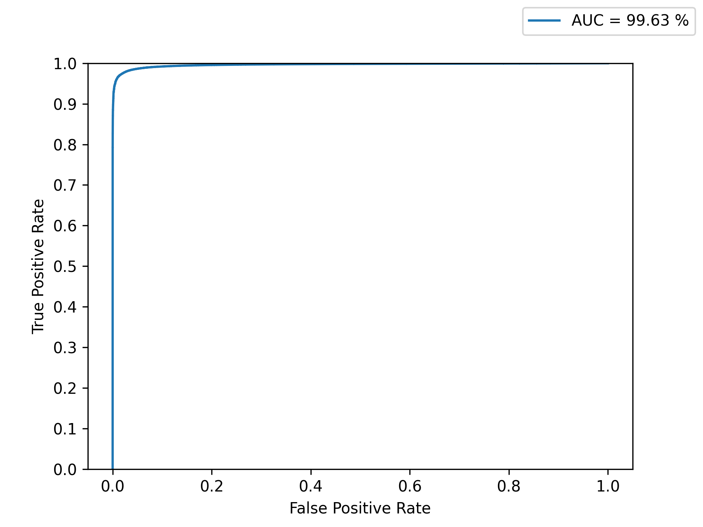
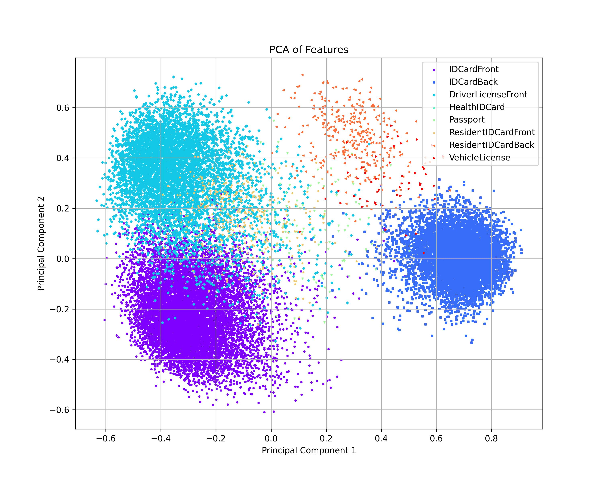

[English](./README.md) | **[中文](./README_cn.md)**

# DocClassifier

<p align="left">
    <a href="./LICENSE"></a>
    <a href="https://github.com/DocsaidLab/DocClassifier/releases"></a>
    <a href=""></a>
</p>

## 介紹

<div align="center">
    
</div>

DocClassifier 是一個創新的文本圖像分類系統，它的設計靈感源自於人臉辨識技術，專門針對傳統分類器在處理文本圖像時面臨的限制進行了深度優化。這個系統非常適合於需要快速識別和註冊新文本類型的場景，如金融科技、銀行業和共享經濟等多個領域。

我們的系統採用先進的特徵學習模型架構，並結合了 CosFace 和 ArcFace 等創新的損失函數，有效地實現了在無需預設大量分類頭類別的情況下進行精確分類。為了訓練此模型，我們自主收集了約800張多樣化的文本圖像，並透過影像增強技術進行數據集的擴充，以確保模型能學習到豐富的特徵。

技術層面上，我們選用了 PyTorch 作為主要訓練框架，並利用 ONNXRuntime 進行模型推論，保證了模型在 CPU 和 GPU 上的高效運行。此外，我們還支援將模型轉換成 ONNX 格式，以便於在不同的平台上進行靈活部署。對於需要進行模型量化的場景，我們提供了基於 ONNXRuntime API 的靜態量化功能，進一步提高了模型的應用靈活性和效能。

在驗證資料集上，我們的模型基於 zero-shot 的訓練策略展示了超過 99% 的準確度。最重要的是，當需要新增證件類型時，DocClassifier 可以實現無需重新訓練即可快速註冊的功能，類似於人臉辨識系統中的人臉註冊流程，這個設計大幅提升了系統的適應性和擴展性。此外，我們的模型在實際應用中不僅達到了即時（Real-Time）的推論速度，更超越了行業標準，滿足了大多數應用場景的需求。

---

## 目錄

---

## 快速開始

### 安裝

目前我們沒有提供 Pypi 上的安裝包，若要使用本專案，您可以直接從 Github 上 clone 本專案，然後安裝相依套件，安裝前請確認您已經安裝了 [DocsaidKit](https://github.com/DocsaidLab/DocsaidKit)。

若已經安裝 DocsaidKit，請按照以下步驟進行：

1. Clone 專案：

   ```bash
   git clone https://github.com/DocsaidLab/DocClassifier.git
   ```

2. 進入專案目錄：

   ```bash
   cd DocClassifier
   ```

3. 建立打包文件：

   ```bash
   python setup.py bdist_wheel
   ```

4. 安裝打包文件：

   ```bash
   pip install dist/docclassifier-*-py3-none-any.whl
   ```

遵循這些步驟，您應該能夠順利完成 DocClassifier 的安裝。

安裝完成後即可以使用本專案。

---

### 導入必要的依賴項

我們提供了一個簡單的模型推論介面，其中包含了前後處理的邏輯。

首先，您需要導入所需的相關依賴並創建 DocClassifier 類別。


```python
import docsaidkit as D
from docsaidkit import Backend
from docclassifier import DocClassifier
```

### Backend

`Backend` 是一個枚舉類型，用於指定 DocClassifier 的運算後端。它包含以下選項：

- `cpu`：使用 CPU 進行運算。
- `cuda`：使用 GPU 進行運算（需要適當的硬體支援）。

ONNXRuntime 支援了非常多的後端，包括 CPU、CUDA、OpenCL、DirectX、TensorRT 等等，若您有其他需求，可以參考 [**ONNXRuntime Execution Providers**](https://onnxruntime.ai/docs/execution-providers/index.html)，並自行修改成對應的後端。

### 創建 DocClassifier 實例

```python
model = DocClassifier(
    gpu_id=0,  # GPU 編號，如果不使用 GPU 請設為 -1
    backend=Backend.cpu,  # 選擇運算後端，可以是 Backend.cpu 或 Backend.cuda
)
```

注意事項：

- 使用 cuda 運算除了需要適當的硬體支援外，還需要安裝相應的 CUDA 驅動程式和 CUDA 工具包。如果您的系統中沒有安裝 CUDA，或安裝的版本不正確，則無法使用 CUDA 運算後端。

- 關於 onnxruntime 安裝依賴相關的問題，請參考 [ONNXRuntime Release Notes](https://onnxruntime.ai/docs/execution-providers/CUDA-ExecutionProvider.html#requirements)

### 讀取和處理圖像

```python
# 讀取圖像
img = D.imread('path/to/your/image.jpg')

# 您也可以使用我們提供的測試圖像
# img = D.imread('docs/run_test_card.jpg')

# 使用模型進行推論
result = model(img) # result 是一個 Document 類型
```

### 輸出結果

您得到的推論結果是基於模組內的註冊資料集，模型會從中找出最相似的類別，並且輸出類別的標籤和分數。

```python
import docsaidkit as D
from docclassifier import DocClassifier

model = DocClassifier(D.Backend.cpu)
img = D.imread('docs/run_test_card.jpg')
result = model(img)
```

<div align="center">
    
</div>

---

## 評估模型（Benchmark）

我們內部有一份測試資料集，但受限於隱私保護，我們無法開源這份資料，只能提供基於這份資料的評估結果。

### 評估協議

1. **AUROC**

    AUROC (Area Under the Receiver Operating Characteristic Curve，接收者操作特徵曲線下面積) 是用於評估分類模型效能的統計指標，特別是在處理二分類問題時。AUROC 值的範圍從 0 到 1，一個較高的 AUROC 值表示模型具有較好的區分兩個類別的能力。

    - **ROC曲線**

        1. **定義**：ROC曲線是一個圖形化的評估工具，展示了分類模型在所有可能的分類閾值下的表現。 它透過將真正例率（TPR, True Positive Rate）和假正例率（FPR, False Positive Rate）在不同閾值下的值繪製在圖表中來實現。

        2. **真正例率（TPR）**：也被稱為敏感度，計算公式為 TPR = TP / (TP + FN)，其中TP是真正例的數量，FN是假負例的數量。

        3. **假正例率（FPR）**：計算公式為 FPR = FP / (FP + TN)，其中FP是假正例的數量，TN是真負例的數量。

    - **AUROC 的計算**

        1. AUROC 是 ROC 曲線下的面積。 它提供了一個單一的度量值來總結模型在所有可能的分類閾值下的表現。

        2. **分析**：
            - **AUROC = 1**：完美分類器，能夠完全區分兩個類別。
            - **0.5 < AUROC < 1**：模型具有區分兩個類別的能力，AUROC 值越接近 1，模型的效能越好。
            - **AUROC = 0.5**：無區分能力，相當於隨機猜測。
            - **AUROC < 0.5**：比隨機猜測還差，但如果模型預測反向解釋（將正類預測為負類，反之亦然），可能會有較好的效能。

2. **Zero-shot Testing**

    我們採取零樣本測試策略，確保測試資料中的所有類別或樣態都沒有出現在訓練資料中。 這意味著在模型的訓練階段，它未曾接觸或學習任何測試集的樣本或類別。 這樣做的目的是為了評估和驗證模型在面對完全未知的數據時的泛化能力和識別性能。

    這種測試方法特別適用於評估零樣本學習（Zero-shot Learning）模型，因為零樣本學習的核心挑戰在於處理模型在訓練期間從未見過的類別。 在零樣本學習的脈絡中，模型通常需要利用其他形式的輔助資訊（如類別的文字描述、屬性標籤或類別間的語意關聯）來建立對新類別的理解。 因此，在零樣本測試中，模型必須依賴它從訓練類別中學到的知識，以及類別間的潛在關聯，來識別測試集中的新樣本。


### 評估結果

<div align="center">

| Models | AUROC |
| :---: | :---: |
| LC080-96-CosFace (Ours) |  0.9963 |

</div>

<div align="center">
    
</div>


- **PCA of features**

    <div align="center">
        
    </div>

---

## 開始訓練模型之前

根據我們所提供的模型，我們相信能解決大部分的應用場景，但是我們也知道，有些場景可能需要更好的模型效果，因此必須自行搜集資料集，並且進行模型微調。我們體諒到您可能只有經費，而沒有足夠的時間對您的現場環境進行客製化調整。因此您可以直接聯絡我們進行諮詢，我們可以根據您施工難度，幫您安排一些工程師來進行客製化的開發。

一個直觀且具體的例子是：

您需要便是一種特殊的文本樣態，但目前我們的模型並沒有辦法有效地進行辨識分類，此時您可以聯絡我們，並且提供一些您收集的資料，我們可以直接把模型強制擬合在您的資料集上面。這樣的方式可以大幅提升模型的效果，但是需要花費大量的時間和人力，因此我們會根據您的需求，提供一個合理的報價。

另外，如果您不急迫，**您可以直接把您的文本資料集提供給我們**，我們會在未來的某一天的某個版本中（沒有提供時程限制），將您的資料集納入我們的測試資料集中，並且在未來的版本中，提供更好的模型效果，選擇這種方式對您來說是完全免費的。

- **請注意：我們絕對不會開源您提供的資料，除非您自行提出要求。正常流程下，資料只會用於更新模型。**

我們樂於見到您選擇第二種方式，因為這樣可以讓我們的模型更加完善，也可以讓更多的人受益。

提交資料集的方式，請參閱：[**提交資料集**](#提交資料集)。

我們的聯絡方式：**docsaidlab@gmail.com**

---

## 訓練模型

我們不提供模型微調的功能，但是您可以使用我們的訓練模組，自行產出模型。

以下我們提供一套完整的訓練流程，幫助您從頭開始。

大致上來說，需要遵循幾個步驟：

1. **準備資料集**：蒐集並整理適合您需求的數據。
2. **建立訓練環境**：配置所需的硬體和軟體環境。
3. **執行訓練**：使用您的數據訓練模型。
4. **評估模型**：檢測模型的效能並進行調整。
5. **轉換為 ONNX 格式**：為了更好的兼容性和效能，將模型轉換成 ONNX 格式。
6. **評估量化需求**：決定是否需要量化模型以優化效能。
7. **整合並打包模型**：將 ONNX 模型整合到您的專案中。

以下我們開始逐步說明訓練流程。

---

## 模型架構設計

### CosFace 模型

- **Backbone: LCNet**

    Backbone 是模型的主體，負責提取輸入數據中的特徵。

    在這個模型中，使用的是 LCNet 輕量級的卷積神經網絡，特別適用於在計算資源受限的環境下進行高效的特徵提取。我們預期 Backbone 應該能從輸入數據中提取出足夠的特徵信息，為後續的度量學習做好準備。

- **Head: Linear**

    Head 是模型的輸出層，負責將 Backbone 提取出的特徵轉換成輸出類別。

    在這個模型中，使用的是一個簡單的線性層，將輸入的特徵向量轉換成輸出類別的概率分佈。和一般線性分類不同之處在於，我們在後續會使用 CosFace 或 ArcFace 等度量學習用的損失函數，因此在輸出的特徵會進行套用 normalize 函數，以符合後續的計算。

- **Loss: CosFace**

    CosFace，也稱為大餘弦損失，是用於臉部辨識任務的深度學習中的損失函數。 其設計原理著重於透過優化類間和類內距離來增強特徵空間中類別之間的可區分性，以提高學習到的特徵的判別力。

    CosFace 主要依賴餘弦相似度，而不是傳統的歐氏距離。 餘弦相似度在處理高維度特徵方面更有效，因為它關注向量之間的角度差異而不是它們的大小。CosFace 對特徵向量進行歸一化，使每個特徵向量的長度為 1。這種歸一化確保模型關注特徵的方向，即角度差異，而不是特徵向量的絕對大小。在計算類別之間的餘弦相似度時引入了額外的裕度。這個邊距的目的是在餘弦空間中推開不同類別的特徵，使同一類別的特徵更加緊密地聚集，而不同類別的特徵更加分散。

    - 數學表達式：

      令 $`x_i`$ 為歸一化特徵向量，$`y_i`$ 為其對應的類別標籤，$`W_{y_i}`$ 為與類別 $`y_i`$ 相關的歸一化權重向量。 CosFace 基於 $`x_i`$ 和 $`W_{y_i}`$ 之間的餘弦相似度，然後引入一個 margin $`m`$：

      $` L = -\frac{1}{N}\sum_{i=1}^{N}\log\frac{e^{s(\cos(\theta_{y_i}) - m)}}{e ^{s(\cos(\theta_{y_i}) - m)} + \sum_{j \neq y_i}e^{s\cos(\theta_j)}} `$

      這裡，$`\theta_{y_i}`$ 和 $`\theta_j`$ 分別是 $`x_i`$ 和 $`W_{y_i}`$ 之間的角度，以及 $`x_i`$ 和其他類權重向量之間的角度。 $`s`$ 是控制決策邊界陡度的縮放參數。

    CosFace 透過引入類間裕度並優化特徵空間中的類內緊湊性，有效增強了臉部辨識任務的表現。它關注特徵向量的方向，而不是它們的大小，使模型更擅長學習區分不同類別的特徵。

---

## 資料集介紹及預處理

大部分的文本圖像都來自於網路搜尋。

除了網路搜尋之外，我們從以下資料集中收集了一些文本圖像：

- **Cards Image Dataset-Classification**
    - [**Dataset**](https://www.kaggle.com/datasets/gpiosenka/cards-image-datasetclassification?resource=download)
    - 這是一個非常高品質的撲克牌圖像資料集。 所有影像均為 jpg 格式，尺寸為 224 X 224 X 3。 資料集中的所有影像都已裁剪，因此僅存在單一卡片的影像，並且該卡片佔據了影像中超過 50% 的像素。 有 7624 個訓練影像、265 個測試影像和 265 個驗證影像。 訓練、測試和驗證目錄分為 53 個子目錄，每個子目錄對應 53 種類型的卡片。 該資料集還包括一個可用於載入資料集的 csv 檔案。

我們沒有納入該資料集的所有資料，因為大多數的樣本相似性極高，沒有辦法達到我們的訓練需求，因此我們僅僅納入了以下幾個類別：

- Joker
- All type of King
- All type of Queen
- All type of Jack

我們從每個類別中，手動挑選了 5~10 張圖片。

最後，我們總共收集了約 840 張文本影像作為基底，並定義以下變換方式：

- 原始影像
- 旋轉 90 度
- 旋轉 180 度
- 旋轉 270 度

搭配水平翻轉，和垂直翻轉，一張影像可以構成 12 種類別，因此我們共約有一萬種文本類別。

以下簡單展示一下擴充邏輯：

```python
def _build_dataset(self):
    fs = D.get_files(self.root, suffix=['.jpg', '.png', '.jpeg'])

    dataset = []
    for label, f in D.Tqdm(enumerate(fs)):
        img = D.imread(f)

        d1 = (label * 12, img)
        d2 = (label * 12 + 1, D.imrotate(img, 90))
        d3 = (label * 12 + 2, D.imrotate(img, 180))
        d4 = (label * 12 + 3, D.imrotate(img, 270))
        d5 = (label * 12 + 4, cv2.flip(img, 0))
        d6 = (label * 12 + 5, cv2.flip(D.imrotate(img, 90), 0))
        d7 = (label * 12 + 6, cv2.flip(D.imrotate(img, 180), 0))
        d8 = (label * 12 + 7, cv2.flip(D.imrotate(img, 270), 0))
        d9 = (label * 12 + 8, cv2.flip(img, 1))
        d10 = (label * 12 + 9, cv2.flip(D.imrotate(img, 90), 1))
        d11 = (label * 12 + 10, cv2.flip(D.imrotate(img, 180), 1))
        d12 = (label * 12 + 11, cv2.flip(D.imrotate(img, 270), 1))

        dataset.extend([d1, d2, d3, d4, d5, d6, d7, d8, d9, d10, d11, d12])

    return dataset
```

---

## 資料集實作

我們針對上述的幾個資料集，進行對應於 pytorch 訓練的資料集實作，請參考 [dataset.py](./model/dataset.py)。

以下展示如何讀取資料集：

```python
import docsaidkit as D
from model.dataset import SyncDataset

ds = SyncDataset(
    image_size=(480, 800),
    return_tensor=False # 如果設定為 True，則回傳的資料會是訓練用的 torch.Tensor 格式。
)

img, label = ds[0]

D.imwrite(img, f'label_{label}.jpg')
```

<div align="center">
    
</div>

- 請注意：這是全合成資料集，因此我們在輸出影像時給予隨機出圖的機制，如果您得到的影像和上面的範例不一樣，請不要驚訝。

### 影像增強

儘管我們很努力地找了很多文本的影像，但數量實在太少了。基本上，每種樣本我們只收集一張。因此，我們需要透過影像增強的方式，來擴充我們的資料集。

```python
class DefaultImageAug:

    def __init__(self, p=0.5):

        self.aug = A.Compose([

            DT.ShiftScaleRotate(
                shift_limit=0.2,
                scale_limit=0.2,
                rotate_limit=15,
            ),

            A.OneOf([
                A.Spatter(mode='mud'),
                A.GaussNoise(),
                A.ISONoise(),
                A.MotionBlur(),
                A.Defocus(),
                A.GaussianBlur(blur_limit=(3, 7), p=0.5),
                A.CoarseDropout(
                    max_holes=1,
                    max_height=32,
                    max_width=32,
                    min_height=5,
                    min_width=5,
                    fill_value=255,
                ),
            ], p=p),

            A.OneOf([
                A.Equalize(),
                A.ColorJitter(),
            ]),

        ], p=p)

    def __call__(self, img: np.ndarray) -> Any:
        img = self.aug(image=img)['image']
        return img
```

- **ShiftScaleRotate**
  - 由於我們已經使用了翻轉，旋轉90度的方式來擴充類別，因此我們不能在這裡使用翻轉，旋轉90度的方式來擴充類別，否則會造成類別衝突。在這裡，只能「稍微地」做一些旋轉和縮放的增強。

- **Others**
  - 我們做了一些雜訊的干擾，但對於顏色的變化還是得非常小心，因為在我們的邏輯中，相同形狀但顏色不同的影像，會被視為不同的類別。

---

## 構建訓練環境

首先，請您確保已經從 `DocsaidKit` 內建置了基礎映像 `docsaid_training_base_image`。

如果您還沒有這樣做，請先參考 `DocsaidKit` 的說明文件。

```bash
# Build base image from docsaidkit at first
git clone https://github.com/DocsaidLab/DocsaidKit.git
cd DocsaidKit
bash docker/build.bash
```

接著，請使用以下指令來建置 DocClassifier 工作的 Docker 映像：

```bash
# Then build DocClassifier image
git clone https://github.com/DocsaidLab/DocClassifier.git
cd DocClassifier
bash docker/build.bash
```

這是我們預設採用的 [Dockerfile](./docker/Dockerfile)，專門為執行文件對齊訓練設計，我們為該文件附上簡短的說明，您可以根據自己的需求進行修改：

1. **基礎鏡像**
    - `FROM docsaid_training_base_image:latest`
    - 這行指定了容器的基礎鏡像，即 `docsaid_training_base_image` 的最新版本。基礎映像像是建立您的 Docker 容器的起點，它包含了預先配置好的作業系統和一些基本的工具，您可以在 `DocsaidKit` 的專案中找到它。

2. **工作目錄設定**
    - `WORKDIR /code`
    - 這裡設定了容器內的工作目錄為 `/code`。 工作目錄是 Docker 容器中的一個目錄，您的應用程式和所有的命令都會在這個目錄下運作。

3. **環境變數**
    - `ENV ENTRYPOINT_SCRIPT=/entrypoint.sh`
    - 這行定義了一個環境變數 `ENTRYPOINT_SCRIPT`，其值設定為 `/entrypoint.sh`。 環境變數用於儲存常用配置，可以在容器的任何地方存取。

4. **安裝 gosu**
    - 透過 `RUN` 指令安裝了 `gosu`。 `gosu` 是一個輕量級的工具，允許使用者以特定的使用者身分執行命令，類似於 `sudo`，但更適合 Docker 容器。
    - `apt-get update && apt-get install -y gosu && rm -rf /var/lib/apt/lists/*` 這行指令首先更新了套件列表，然後安裝`gosu`，最後清理了不再需要 的檔案以減小鏡像大小。

5. **建立入口點腳本**
    - 透過一系列 `RUN` 指令建立了入口點腳本 `/entrypoint.sh`。
    - 此腳本首先檢查環境變數 `USER_ID` 和 `GROUP_ID` 是否被設定。 如果設定了，腳本會建立一個新的使用者和使用者群組，並以該使用者身分執行命令。
    - 這對於處理容器內外檔案權限問題非常有用，特別是當容器需要存取宿主機上的檔案時。

6. **賦予權限**
    - `RUN chmod +x "$ENTRYPOINT_SCRIPT"` 這行指令使入口點腳本成為可執行檔。

7. **設定容器的入口點和預設指令**
    - `ENTRYPOINT ["/bin/bash", "/entrypoint.sh"]` 和 `CMD ["bash"]`
    - 這些命令指定了容器啟動時執行的預設命令。 當容器啟動時，它將執行 `/entrypoint.sh` 腳本。

---

## 執行訓練（Based on Docker）

這部分的說明如何利用您已經構建的 Docker 映像來執行文件對齊訓練。

首先，請您看到 `train.bash` 檔案內容：

```bash
#!/bin/bash

cat > trainer.py <<EOF
from fire import Fire
from DocClassifier.model import main_docclassifier_train

if __name__ == '__main__':
    Fire(main_docclassifier_train)
EOF

docker run \
    -e USER_ID=$(id -u) \
    -e GROUP_ID=$(id -g) \
    --gpus all \
    --shm-size=64g \
    --ipc=host --net=host \
    --cpuset-cpus="0-31" \
    -v $PWD/DocClassifier:/code/DocClassifier \
    -v $PWD/trainer.py:/code/trainer.py \
    -v /data/Dataset:/data/Dataset \
    -it --rm doc_classifier_train python trainer.py --cfg_name $1
```

針對上述檔案的說明如下，如果您想要動手修改的話，可以參考相關資訊：

1. **創建訓練腳本**
   - `cat > trainer.py <<EOF ... EOF`
   - 這段命令創建了一個 Python 腳本 `trainer.py`。這個腳本導入了必要的模塊和函數，並在腳本的主部分中調用 `main_docalign_train` 函數。使用 Google's Python Fire 庫來解析命令行參數，使得命令行界面的生成更加容易。

2. **運行 Docker 容器**
   - `docker run ... doc_classifier_train python trainer.py --cfg_name $1`
   - 這行命令啟動了一個 Docker 容器，並在其中運行 `trainer.py` 腳本。
   - `-e USER_ID=$(id -u) -e GROUP_ID=$(id -g)`：這些參數將當前用戶的用戶 ID 和組 ID 傳遞給容器，以便在容器內創建具有相應權限的用戶。
   - `--gpus all`：指定容器可以使用所有 GPU。
   - `--shm-size=64g`：設置共享內存的大小，這在大規模數據處理時很有用。
   - `--ipc=host --net=host`：這些設置允許容器使用主機的 IPC 命名空間和網絡堆棧，有助於性能提升。
   - `--cpuset-cpus="0-31"`：指定容器使用哪些 CPU 核心。
   - `-v $PWD/DocClassifier:/code/DocClassifier` 等：這些是掛載參數，將主機的目錄映射到容器內部的目錄，以便於訓練數據和腳本的訪問。ㄋ
   - `--cfg_name $1`：這是傳遞給 `trainer.py` 的參數，指定了配置文件的名稱。

3. **數據集路徑**
   - 特別注意 `/data/Dataset` 是用於存放訓練數據的路徑，您會需要調整 `-v /data/Dataset:/data/Dataset` 這段指令，把 `/data/Dataset` 替換成您的資料集目錄。

最後，請退到 `DocClassifier` 的上層目錄，並執行以下指令來啟動訓練：

```bash
bash DocClassifier/docker/train.bash lcnet050_cosface_96 # 這裡替換成您的配置文件名稱
```

- 補充：配置文件說明可以參考 [DocClassifier/model/README.md](./model/README.md)。

通過這些步驟，您可以在 Docker 容器內安全地執行文件對齊訓練任務，同時利用 Docker 的隔離環境來確保一致性和可重現性。這種方法使得項目的部署和擴展變得更加方便和靈活。

---

## 轉換模型為 ONNX 格式（Based on Docker）

這部分的說明如何利用您的模型轉換為 ONNX 格式。

首先，請您看到 `to_onnx.bash` 檔案內容：

```bash
#!/bin/bash

cat > torch2onnx.py <<EOF
from fire import Fire
from DocClassifier.model import main_docclassifier_torch2onnx

if __name__ == '__main__':
    Fire(main_docclassifier_torch2onnx)
EOF

docker run \
    -e USER_ID=$(id -u) \
    -e GROUP_ID=$(id -g) \
    --shm-size=64g \
    --ipc=host --net=host \
    -v $PWD/DocClassifier:/code/DocClassifier \
    -v $PWD/torch2onnx.py:/code/torch2onnx.py \
    -it --rm doc_classifier_train python torch2onnx.py --cfg_name $1
```

從這個檔案開始看起，但不需要修改它，您需要去修改對應的檔案：`model/to_onnx.py`

在訓練過程中，您可能會使用許多分支來監督模型的訓練，但是在推論階段，您可能只需要其中的一個分支。因此，我們需要將模型轉換為 ONNX 格式，並且只保留推論階段所需要的分支。

例如：

```python
class WarpFeatureLearning(nn.Module):

    def __init__(self, model: L.LightningModule):
        super().__init__()
        self.backbone = model.backbone
        self.head = model.head

    def forward(self, img: torch.Tensor):
        xs = self.backbone(img)
        features = self.head(xs)
        return features
```

在上面這個範例中，我們只取出推論用的分支，並且將其封裝為一個新的模型 `WarpFeatureLearning`。接著，在 yaml config 上進行相對應的參數設定：

```yaml
onnx:
  name: WarpFeatureLearning
  input_shape:
    img:
      shape: [1, 3, 96, 96]
      dtype: float32
  input_names: ['img']
  output_names:
    - feats
  dynamic_axes:
    img:
      '0': batch_size
    output:
      '0': batch_size
  options:
    opset_version: 16
    verbose: False
    do_constant_folding: True
```

說明模型的輸入尺寸，輸入名稱，輸出名稱，以及 ONNX 的版本號。

轉換的部分我們已經幫您寫好了，完成上面的修改後，確認 `model/to_onnx.py` 檔案有指向您的模型，並且退到 `DocClassifier` 的上層目錄，並執行以下指令來啟動轉換：

```bash
bash DocClassifier/docker/to_onnx.bash lcnet050_cosface_96 # 這裡替換成您的配置文件名稱
```

這時候，您會在 `DocClassifier/model` 目錄下看到一個新的 ONNX 模型，把這個模型搬到 `docclassifier/xxx` 對應的推論模型目錄下，就可以進行推論了。

---

## 提交資料集

首先，我們非常感謝您願意提供資料集，我們會在第一時間進行測試和整合。

在這個任務中，您需要提供文本樣板，且不帶有任何邊緣和背景，就如同我們所開源的資料集一樣。

您不需要給予任何標籤，我們會在整合的過程中，自動為您的資料集進行標籤。

建議您將資料上傳至您的 google 雲端，並透過[電子郵件](docsaidlab@gmail.com)提供給我們連結，我們會在收到您的資料後，盡快進行測試和整合。若您所提供的資料不符合我們的需求，我們會在第一時間通知您。

- **不符合需求的原因可能有**：
    - **資料集精度不足**：例如您的資料集中不是經過校正後的滿版影像，而是帶有背景雜訊。
    - **資料集解析度過低**：雖然我們在訓練模型的過程中僅使用 96 x 96 大小的影像，但我們希望原始的影像品質不能太差 —— 至少肉眼可以辨識，我們相信這個的要求已經很低了，還請見諒。

---

## 常見問題（FAQs）

1. **我提交了的資料，效果就會好嗎？**
   - 不好說。雖然我們讓模型看過您所提供的資料，但這不表示這份資料的特徵能夠對模型產生足夠的影響力。只能說有看過比沒看過好，但是不見得就會有很大的提升。

2. **檔案名稱的重要性如何？**
   - 檔案名稱不是主要關注點，只要能正確連接到相應的影像即可。

3. **影像格式有何建議？**
   - 建議使用 jpg 格式以節省空間。

若需要更多幫助，請透過電子郵件與我們聯繫：**docsaidlab@gmail.com**

---

## 引用

我們感謝所有走在前面的人，他們的工作對我們的研究有莫大的幫助。

如果您認為我們的工作對您有幫助，請引用以下相關論文：

```bibtex
@misc{lin2023docclassifier,
  author = {Kun-Hsiang Lin, Ze Yuan},
  title = {DocClassifier},
  year = {2024},
  publisher = {GitHub},
  journal = {GitHub repository},
  doi = {},
  howpublished = {\url{https://github.com/DocsaidLab/DocClassifier}}
}

@misc{rw2019timm,
  author = {Ross Wightman},
  title = {PyTorch Image Models},
  year = {2019},
  publisher = {GitHub},
  journal = {GitHub repository},
  doi = {10.5281/zenodo.4414861},
  howpublished = {\url{https://github.com/rwightman/pytorch-image-models}}
}

@misc{gpiosenka_cards_2023,
  author = {Gerry},
  title = {{Cards Image Dataset for Classification}},
  year = {2023},
  howpublished = {\url{https://www.kaggle.com/datasets/gpiosenka/cards-image-datasetclassification?resource=download}},
  note = {Accessed: 2024-01-19},
  license = {CC0: Public Domain}
}

@inproceedings{deng2018arcface,
title={ArcFace: Additive Angular Margin Loss for Deep Face Recognition},
author={Deng, Jiankang and Guo, Jia and Niannan, Xue and Zafeiriou, Stefanos},
booktitle={CVPR},
year={2019}
}

@inproceedings{wang2018cosface,
  title={Cosface: Large margin cosine loss for deep face recognition},
  author={Wang, Hao and Wang, Yitong and Zhou, Zheng and Ji, Xing and Gong, Dihong and Zhou, Jingchao and Li, Zhifeng and Liu, Wei},
  booktitle={Proceedings of the IEEE conference on computer vision and pattern recognition},
  pages={5265--5274},
  year={2018}
}
```
