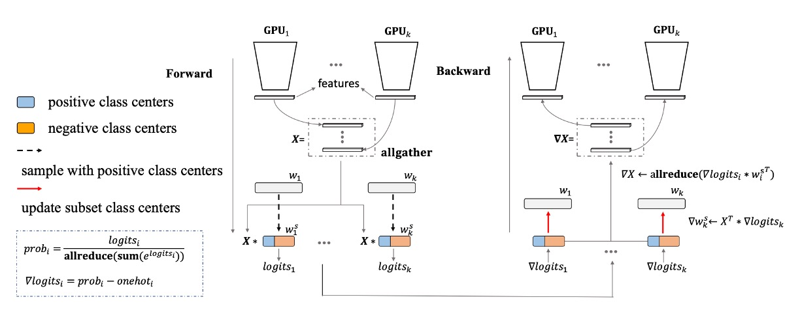

[English](./README.md) | **[中文](./README_tw.md)**

# DocClassifier

<p align="left">
    <a href="./LICENSE"></a>
    <a href="https://github.com/DocsaidLab/DocClassifier/releases"></a>
    <a href=""></a>
</p>

## 介紹

<div align="center">
    
</div>

DocClassifier 是一個基於 Metric Learning 技術的文件圖像分類系統，受到傳統分類器面臨的挑戰啟發，解決了文件類型快速增加和難以定義的問題。它採用了 PartialFC 特徵學習架構，集成了 CosFace 和 ArcFace 等技術，使模型能夠在不需要大量預定義類別的情況下進行精確分類。通過擴展數據集和引入 ImageNet-1K 和 CLIP 模型，我們提高了性能並增加了模型的適應性和可擴展性。模型使用 PyTorch 進行訓練，在 ONNXRuntime 上進行推理，並支持將模型轉換為 ONNX 格式以便在不同平台上部署。在測試中，我們的模型達到了超過 90%的準確率，並具有快速推理速度和快速添加新文件類型的能力，從而滿足了大多數應用場景的需求。

## 技術文件

由於本專案的相關使用方式和設定的說明佔據非常多的篇幅，因此我們謹摘要「模型設計」的部分放在這裡。

如果你想知道更多的細節，請參閱 [**DocClassifier Documents**](https://docsaid.org/docs/docclassifier/)。

## 模型設計

一個較為完整的模型功能，都不是一蹴可幾的，中間必須經過多次的調整和設計。

### 第一代模型


第一代模型是我們最早期的版本，它的基本架構分成四個部分：

1. **特徵提取**

   

   這部分主要是用來將影像轉換成向量，這裡使用了 [**PP-LCNet**](https://arxiv.org/abs/2109.15099) 作為特徵提取器。

   輸入影像為 128 x 128 的 RGB 影像，經過特徵提取器後，輸出一個 256 維的向量。

2. **CosFace**

   [](https://arxiv.org/pdf/1801.09414.pdf)

   我們打從一開始就想測試度量學習的效果，所以我們直接跳過了傳統分類器的實作，首先使用了 [**CosFace**](https://arxiv.org/abs/1801.09414) 的方法。由於這裡的重點不是帶大家認識 Margin-based 的方法，所以這裡不要占用太多篇幅。如果你有需要的話，我們之後可以在論文閱讀那裡新增一個主題來專門介紹相關的演進。

   簡單來說，CosFace 是一種基於 margin 的方法，它在原本的 softmax 損失函數上加入了一個 margin 參數，使得模型在訓練時更加容易區分不同的類別。

3. **Dataset**

   為了訓練模型，我們寫了一個簡單的爬蟲，到網路上抓取一些文件的影像。

   大概有 650 多種不同的文件，大部分是各大銀行的信用卡。

   這一份資料我們放在這裡：[**UniquePool**](https://github.com/DocsaidLab/DocClassifier/tree/main/data/unique_pool)，有興趣請自行下載。

4. **Training**

   我們使用了 PyTorch 來訓練模型，這裡不多做介紹。

   這裡要提的是給定資料類別的方式：在這一代模型中，我們將「每一張」圖片視為一個類別。因為我們希望模型可以確實地找到各種文件不同的地方，既然對模型這種期待，那就不應該把不同的文件（儘管可能只有一點差異）放在同一個類別裡面。

   這個設計方式衍伸出一個問題，就是類別數量太多，原始資料太少（只有 1 張）。所以必須搭配影像增強的方法，來增加資料量。

   資料增強的模組我們選擇使用 [**Albumentations**](https://github.com/albumentations-team/albumentations)，這是一個非常好用的資料增強模組，可以幫助我們快速地增加資料量，在此也順便推薦給大家。

---

第一代模型著重的是想法的驗證，我們在第一代中確認了這個想法是可行的。

但是在實際應用中，我們發現了一些問題：

1. **穩定性**

   在實際測試場景中，我們發現模型的穩定性不夠好，容易受到外在環境的變化。特別是文件在校正的過程中出現了一些變形，這對模型的影響非常大。但文件變形是必然會發生的，而且一個穩定的模型也不該被一點扭曲變形所干擾。

2. **效能**

   在實際測試場景中，我們發現相似的文件會讓模型產生混淆，這表示模型學習到的特徵不夠好，無法很好地區分不同的文件。

綜合以上兩點，所以我們的結論是：**模型過擬合了！**

### 第二代模型


第二代模型是我們在第一代模型的基礎上進行了一些改進：

1. **增加資料**

   我們實在找不到更多的文件了。

   所以我們想：**何不把其他開源資料集的資料也都視為一種文件呢？**

   於是我們找來了 [**Indoor Scene Recognition**](https://web.mit.edu/torralba/www/indoor.html)，這是一個 MIT 的開源資料集，裡面有 67 種不同的室內場景。共有約 15,620 張影像。於是我們就多了這麼多類型的「文件」。

2. **改用 PartialFC**

   

   類別數量一提上去，巨大分類頭的問題立刻就暴露出來了。

   在人臉辨識的領域中，有一個非常有名的方法叫做 [**PartialFC**](https://arxiv.org/abs/2203.15565)，該研究團隊發現在臉部特徵學習中，Softmax 函數中負類別（即非目標類別）的重要性並不像之前想象的那麼高。他們的實驗表明，當使用 Softmax 基於損失函數訓練時，即使只隨機抽樣 10% 的類別，與使用所有類別進行訓練相比，也不會失去準確性。

3. **更多的資料**

   儘管我們增加了資料，但是我們發現過擬合的問題雖然有緩解了，但是沒有解決。模型學到的特徵還是不夠好，無法很好地區分相似的文件。

   於是我們對資料集進行了一些調整，把每張影像進行旋轉、翻轉和裁切等操作，如此一來，一張影像就可以定義出「24 個」類別。

   這個邏輯大概是：

   - 原始影像
   - 旋轉 90 度
   - 旋轉 180 度
   - 旋轉 270 度
   - 水平翻轉
   - 水平翻轉 + 旋轉 90 度
   - 水平翻轉 + 旋轉 180 度
   - 水平翻轉 + 旋轉 270 度
   - 原始影像（上半部）
   - 原始影像（上半部）+ 旋轉 90 度
   - 原始影像（上半部）+ 旋轉 180 度
   - ......

   這樣一來，我們就可以把原本的影像變成了 (15,620 + 650) x 24 = 390,480 張影像（類別）。

4. **更多更多的資料！**

   過擬合的問題持續在緩解，但是沒有解決。

   顯然地，不管怎麼定義「新的」類別，單純使用 **Indoor Scene Recognition** 的資料還是不夠的，我們需要更多的多樣性，來支撐模型的學習。

   於是我們決定捨棄 **Indoor Scene Recognition**，改用 [**ImageNet-1K**](https://www.image-net.org/)，這是一個非常大的資料集，裡面有 1,000 種不同的類別，共有約 1,281,167 張影像。

   終於，在我們把類別擴充到 128 萬多之後，過擬合的問題得到了解決。

### 第三代模型


我們追求更穩定的模型，所以我們嘗試引入一些新的方法：

1. **CLIP**

   雖然距離 OpenAI 提出 [**CLIP**](https://arxiv.org/abs/2103.00020) 也過了好幾年了，但這個想法仍持續在各個領域發揮著作用。我們認為可以在原有的架構中，加入一些 CLIP 的特性來提升模型的穩定性。

   這裡假設的邏輯是：由於 CLIP 看過更多的影像，所以我們合理地認為 CLIP 可以提供更穩健的特徵向量。因此，我們將自己的模型所學習到的特徵和 CLIP 對齊，勢必能取得更好的特徵表現。

   為了驗證我們的猜想，於是設計了整個流程如下：

   1. 第二代架構維持不變。
   2. 將原始影像輸入我們自己建置的 CNN Backbone 中，取得影像的特徵向量，特徵 1。
   3. 輸入影像的同時，將原始影像輸入 CLIP-Image 分支，取得影像的特徵向量，特徵 2。
   4. 計算特徵 1 和特徵 2 的 KLD 損失（這是一個考慮向量相似性的損失函數）。
   5. 將 KLD 損失加入到原有的損失函數中，凍結 CLIP-Image 分支的參數，只訓練第二代的架構分支。

   這個嘗試取得前所未有的成功，我們的模型在穩定性上有了很大的提升，並且在驗證資料集上面提升了接近 5 個百分點。

2. **疊加標準化層**

   在第二代模型中，我們測試了很多不同的標準化層，包括 BatchNorm、LayerNorm、InstanceNorm 等等。有別於人臉辨識的模型，在人臉辨識的模型中，普遍是使用 BatchNorm 得到較優異的結果，在我們的實驗中，使用 LayerNorm 效果更好。

   但是在一個偶然的實驗中，我們發現了有個更好的標準化方式：

   - **同時使用 BatchNorm 和 LayerNorm！**

   發現這個方法的原因是因為訓練的時候忘記刪除，結果發現怎麼跑分突然提升了 5 個百分點？

   ```python
   self.embed_feats = nn.Sequential(
       nn.Linear(in_dim_flatten, embed_dim, bias=False),
       nn.LayerNorm(embed_dim),
       nn.BatchNorm1d(embed_dim),
       nn.Linear(embed_dim, embed_dim, bias=False),
       nn.LayerNorm(embed_dim),
       nn.BatchNorm1d(embed_dim),
   )
   ```

   我們仔細排查後，確認是這個行為帶來了提升，於是我們就採用了這個方法。

## 結論

第三代的模型在穩定性和效能上都有了很大的提升。

我們覺得這個模型的表現還說得過去，在實際應用中也取得了不錯的效果。

我們認為這個專案的階段性任務已經完成，所以我們把這一系列的結果發表在這裡，希望能夠對大家有所幫助。

## 引用

我們感謝所有走在前面的人，他們的工作對我們的研究有莫大的幫助。

如果您認為我們的工作對您有幫助，請引用以下相關論文：

```bibtex
@misc{lin2024docclassifier,
  author = {Kun-Hsiang Lin, Ze Yuan},
  title = {DocClassifier},
  year = {2024},
  publisher = {GitHub},
  journal = {GitHub repository},
  doi = {10.5281/zenodo.10538356},
  howpublished = {\url{https://github.com/DocsaidLab/DocClassifier}}
}

@misc{rw2019timm,
  author = {Ross Wightman},
  title = {PyTorch Image Models},
  year = {2019},
  publisher = {GitHub},
  journal = {GitHub repository},
  doi = {10.5281/zenodo.4414861},
  howpublished = {\url{https://github.com/rwightman/pytorch-image-models}}
}

@misc{gpiosenka_cards_2023,
  author = {Gerry},
  title = {{Cards Image Dataset for Classification}},
  year = {2023},
  howpublished = {\url{https://www.kaggle.com/datasets/gpiosenka/cards-image-datasetclassification?resource=download}},
  note = {Accessed: 2024-01-19},
  license = {CC0: Public Domain}
}

@inproceedings{deng2018arcface,
title={ArcFace: Additive Angular Margin Loss for Deep Face Recognition},
author={Deng, Jiankang and Guo, Jia and Niannan, Xue and Zafeiriou, Stefanos},
booktitle={CVPR},
year={2019}
}

@inproceedings{wang2018cosface,
  title={Cosface: Large margin cosine loss for deep face recognition},
  author={Wang, Hao and Wang, Yitong and Zhou, Zheng and Ji, Xing and Gong, Dihong and Zhou, Jingchao and Li, Zhifeng and Liu, Wei},
  booktitle={Proceedings of the IEEE conference on computer vision and pattern recognition},
  pages={5265--5274},
  year={2018}
}
```
