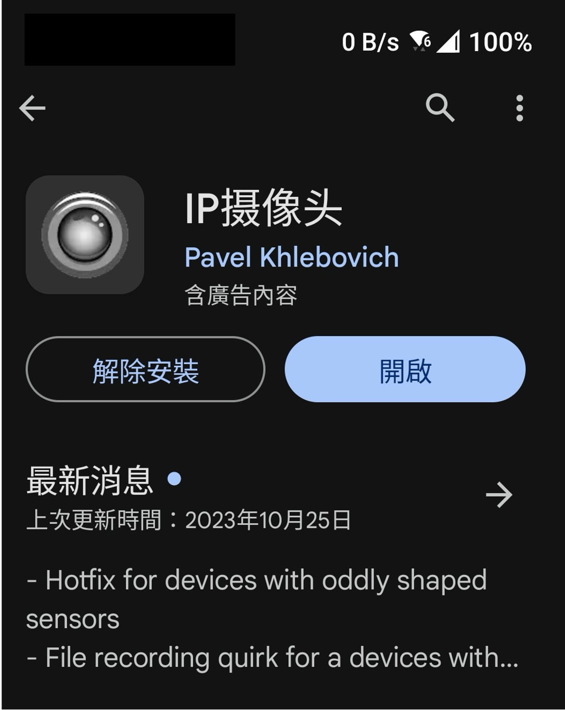
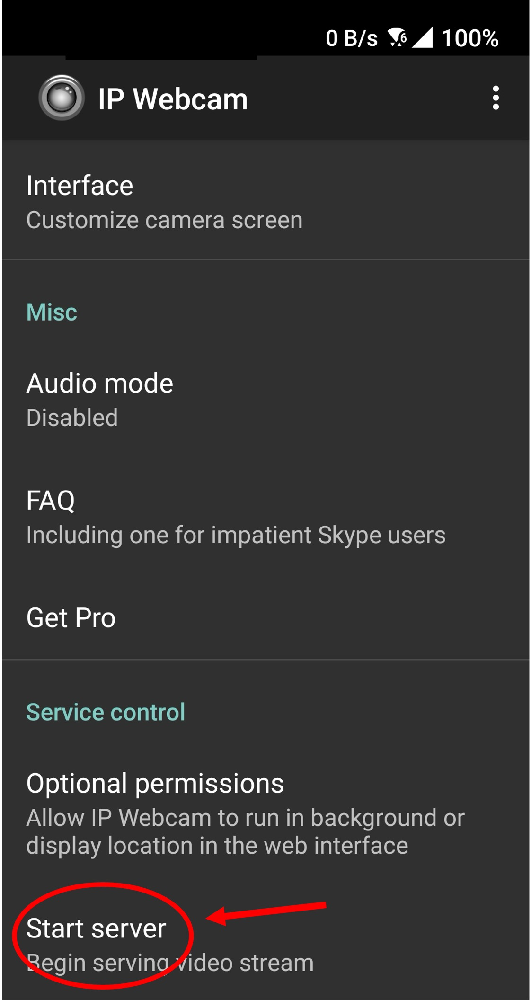
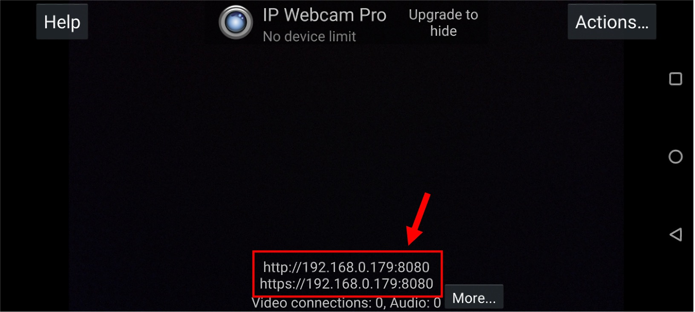
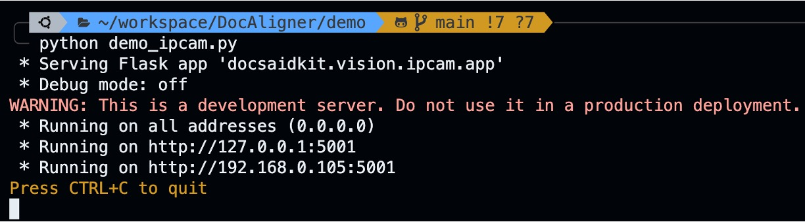
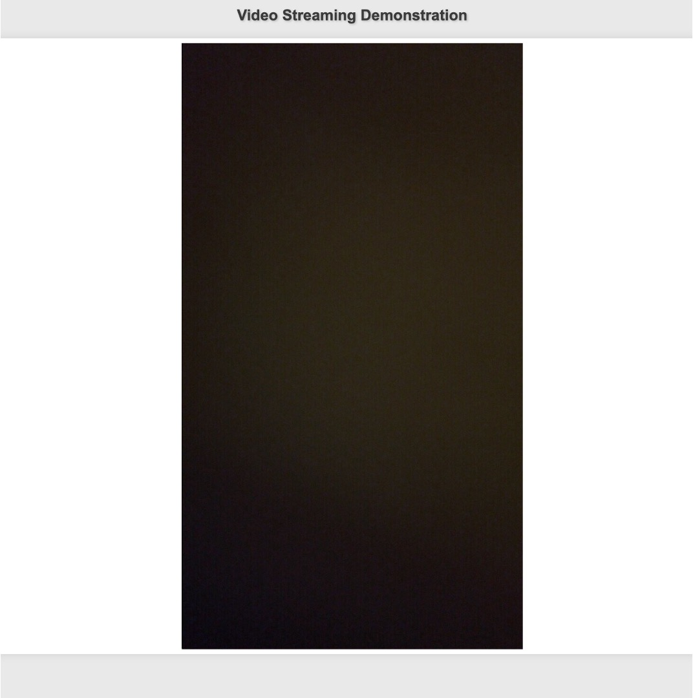

**[English](./README.md)** | [中文](./README_cn.md)

# Web demo for DocClassifier

We offer a web-based demo that allows users to directly test the effects of DocClassifier.

To run this demo, you first need to set up the environment for DocClassifier. Please refer to [README.md](../README.md) for instructions.

## Step 1: Install the Mobile App

First, ensure that your workstation and mobile phone are on the same network.

We will be connecting to an ipcam, currently using the mobile app "IP Camera".

Please download and install the app on your mobile:

<div align="center">
    
</div>

Then, launch the app and select "Start server":

<div align="center">
    
</div>

A URL will appear; please note it down as it is the internally assigned network address:

<div align="center">
    
</div>

For instance, in this image, the assigned domain is: `192.168.0.179`.

## Step 2: Set Up IP Address

In `demo_ipcam.py`, there is a section of code:

```python
import docsaidkit as D
from docclassifier import DocClassifier

IPADDR = '192.168.0.179'  # Change this to your IP camera address
...
```

Please change `IPADDR` to your IP camera address.

## Step 3: Run the Demo

Next, we can run the demo:

```bash
python demo_ipcam.py
```

After execution, a piece of information will appear in the terminal:

<div align="center">
    
</div>

This is the URL of your workstation, for example, `192.168.0.105:5001` as shown above.

Enter this URL in your web browser to view the demo:

<div align="center">
    
</div>

Once the screen appears, you can walk around with your mobile phone and observe the performance of DocClassifier.
