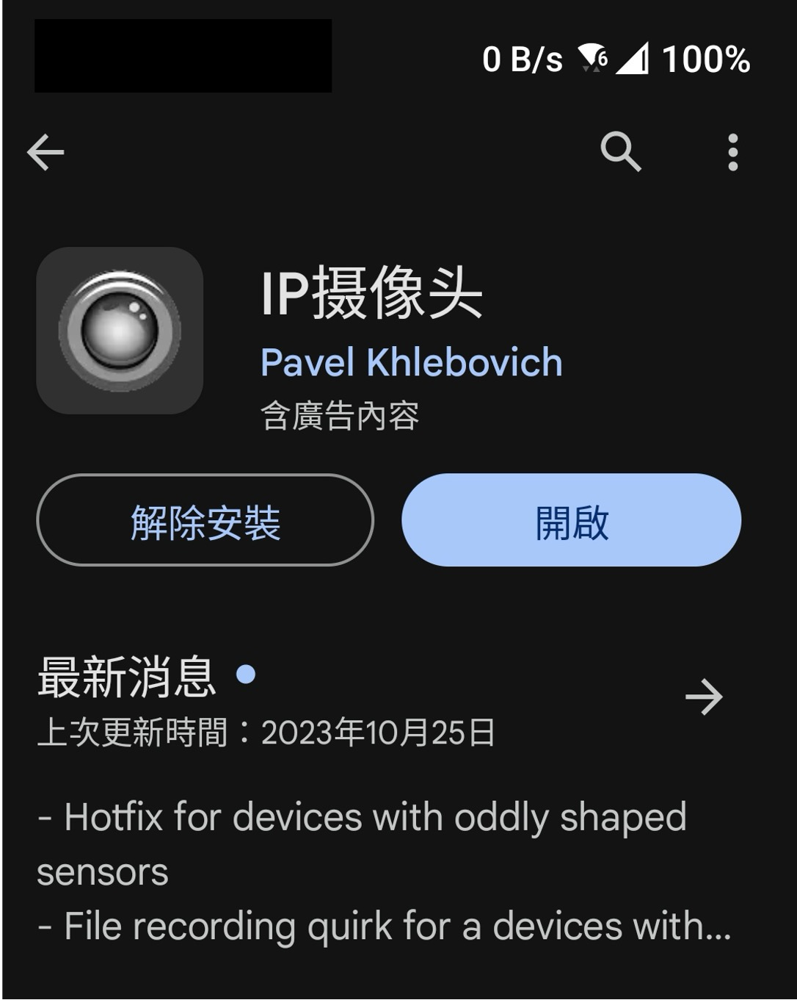
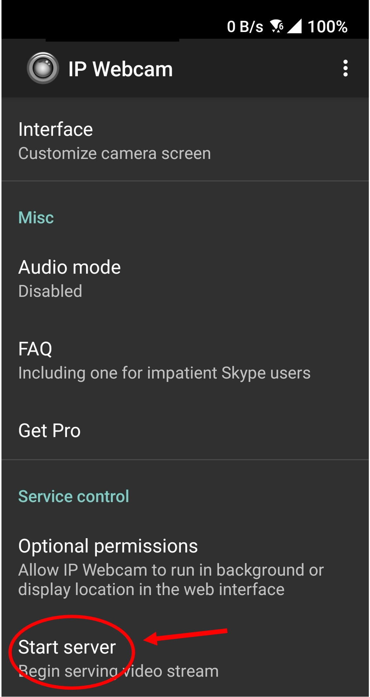
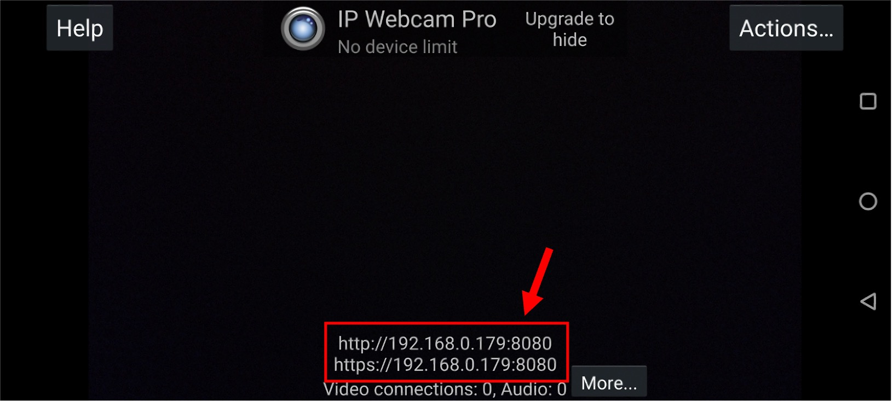
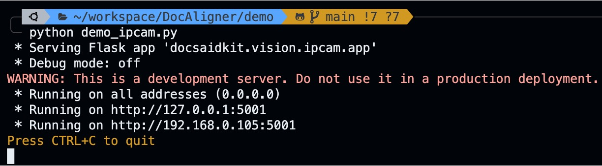
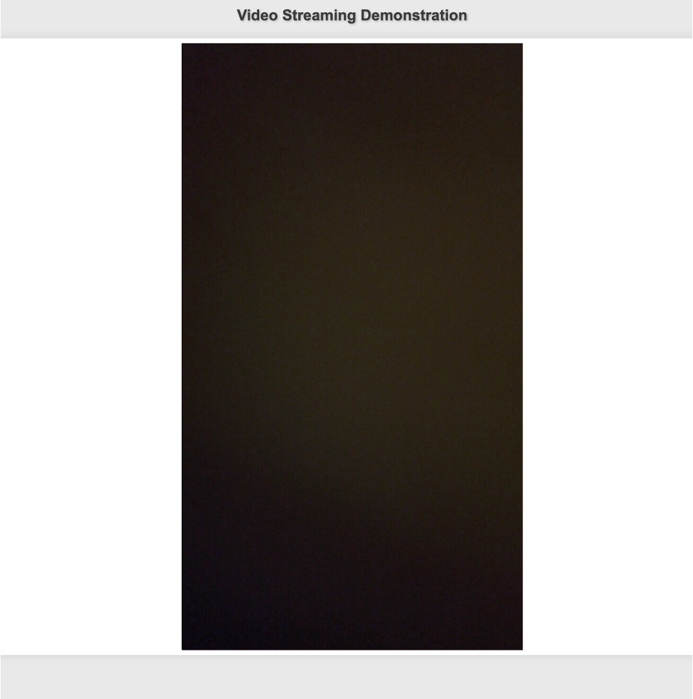

**[English](./README.md)** | [中文](./README_cn.md)

# Web demo for DocClassifier

我們提供了一個網頁版的 Demo，可以讓使用者直接測試 DocClassifier 的效果。

要執行這個 Demo，首先需要安裝 DocClassifier 的環境，請參考 [README.md](../README.md)。

## 步驟一：安裝手機 APP

首先，請您確保工作主機和手機在同一個網路下。

我們要串接一個 ipcam，目前使用的是手機 app：「IP 攝像頭」。

請先在手機上下載安裝：

<div align="center">
    
</div>

接著啟動 APP，點選 「Start server」：

<div align="center">
    
</div>

接著會出現一個網址，請記下來，這是內網自動分配：

<div align="center">
    
</div>

以這張圖為例，我們被分配到的網域是：`192.168.0.179`。

## 步驟二：設定 ip address

在 `demo_ipcam.py` 中，有一段程式碼：

```python
import docsaidkit as D
from docclassifier import DocClassifier

IPADDR = '192.168.0.179'  # Change this to your IP camera address
...
```

請將 `IPADDR` 改成您的 IP camera address。

## 步驟三：執行 Demo

接著，我們就可以執行 Demo 了：

```bash
python demo_ipcam.py
```

執行後，我們會在終端機上看到一段資訊：

<div align="center">
    
</div>

這是您的主機的網址，以上圖為例，就是 `192.168.0.105:5001`。

在您的網頁上輸入這個網址，就可以看到 Demo 的畫面：

<div align="center">
    
</div>

當畫面出現時，您可以拿著手機，四處走動，看看 DocClassifier 的效果吧。
